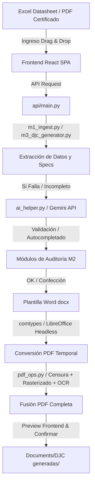

# CONTEXT.md — Argos

## Qué es
Argos es una plataforma de escritorio local diseñada para Bidcom SRL que automatiza el proceso de auditoría de certificados de seguridad y la generación masiva de Declaraciones Juradas de Conformidad (DJC), certificados de Eficiencia Energética (EE) y solicitudes de certificación (para Lenor y Quektra). Combina reglas de negocio locales, extracción clásica de texto y auditoría semántica avanzada a través de la API de Google Gemini para optimizar los tiempos de gestión e importación de productos.

## Stack
El stack tecnológico del proyecto está compuesto por las siguientes tecnologías y versiones específicas:

*   **Backend (Servidor API local):**
    *   **Python >= 3.10** como lenguaje de programación base.
    *   **FastAPI >= 0.111.0** para la definición de endpoints REST y comunicación en tiempo real.
    *   **Uvicorn >= 0.29.0** como servidor ASGI de alto rendimiento.
    *   **Pydantic >= 2.0.0** para validación de esquemas y tipos de datos.
*   **Frontend (Single Page Application):**
    *   **React ^19.2.4** con **React-DOM ^19.2.4** como framework de interfaz de usuario.
    *   **TypeScript ~5.9.3** para tipado seguro en la SPA.
    *   **Vite ^8.0.1** como empaquetador y servidor de desarrollo.
    *   **Tailwind CSS ^4.2.2** (mediante el plugin `@tailwindcss/vite` ^4.2.2) para el estilado responsive y Dark Theme.
    *   **Lucide React ^1.16.0** para la iconografía del sistema.
    *   **html-to-image ^1.11.13** para exportaciones y renderizados visuales.
*   **Procesamiento de Documentos y PDF:**
    *   **PyMuPDF (fitz)** para la lectura de texto, censura de datos y rasterizado de PDF.
    *   **python-docx** para la edición y llenado automatizado de las plantillas Word de DJC.
    *   **openpyxl** para el parsing de las planillas de ingeniería y fallback de escritura de planillas de solicitud Excel.
*   **Automatización de Escritorio (COM/OS):**
    *   **CustomTkinter** / **Tkinter** para la interfaz del panel de control del servidor local.
    *   **comtypes / pywin32** para controlar Microsoft Word y Excel a nivel de sistema operativo en Windows (conversión de Word a PDF y guardado de hojas habilitadas para macros con macros intactas).
*   **Servicios Externos e Inteligencia Artificial:**
    *   **Google GenAI SDK** (`google-genai` para el backend, interactuando con el modelo **gemini-2.5-flash-lite** en su plan gratuito) para la extracción inteligente de datos complejos y validación semántica flexible.
    *   **Tesseract OCR (pytesseract)** para la extracción de texto en imágenes y certificados rasterizados.

## Arquitectura
El sistema de Argos está estructurado de forma modular y separada entre la lógica de backend (Python) y de frontend (React), alojando y sirviendo la SPA estática directamente desde el servidor local de FastAPI.

### Estructura de Módulos y Archivos Clave
*   `launcher.py` (160 líneas): El punto de entrada principal del software. Lanza un panel Tkinter/CustomTkinter que ejecuta la API en un hilo secundario (`uvicorn.run`), encuentra un puerto libre dinámicamente y levanta el navegador en modo aplicación sin bordes (`--app={URL}`) apuntando a dicho puerto.
*   `api/main.py` (1016 líneas - **Archivo Complejo >40KB**): Orquestador del backend. Expone los endpoints principales `/api/config`, `/api/djc/extract`, `/api/djc/generate`, `/api/djc/confirm`, `/api/ee/families`, `/api/ee/generate`, `/api/ee/confirm`, `/api/verify` y `/api/solicitud/parse`. Controla `LogBroadcaster` mediante WebSockets (`/ws/log`) para transmitir logs de la consola en vivo a la UI.
*   `modules/`
    *   `m1_ingest.py` (~270 líneas): Parsea y extrae datos técnicos del datasheet del producto cargado (Excel) buscando las especificaciones eléctricas clásicas.
    *   `m2_audit.py` (~150 líneas): Contiene la clase base `CertAuditor` encargada de validar las coincidencias de los modelos, fechas de vigencia y marcas del certificado contra los datos del datasheet.
    *   `m2_multiaudit.py` (~110 líneas): Clase `MultiCertAuditor` que coordina la validación de múltiples certificados concurrentemente y elabora un reporte estructurado de fallas y advertencias.
    *   `m2_strategies.py` (~450 líneas): Implementa el patrón Strategy (`AuditStrategy`, `LenorToyStrategy`, `CBSchemeStrategy`, `QuektraStrategy`) que se seleccionan dinámicamente según las palabras clave encontradas en el certificado para aplicar reglas de auditoría customizadas.
    *   `m3_djc_generator.py` (1247 líneas - **Archivo Complejo >30KB**): Motor orquestador para la generación de DJC comunes. Completa la plantilla de Word, la convierte a PDF y llama a la censura y rasterización final.
    *   `m4_djc_ee_generator.py` (487 líneas): Motor encargado de generar las DJC de Eficiencia Energética basadas en las 11 familias de la Res. 438/2024 definidas en `ee_families.json`. Renderiza y dibuja las etiquetas en el Word como imagen PNG.
    *   `m5_solicitud_generator.py` (1653 líneas - **Archivo Complejo >75KB**): Orquestador del módulo de solicitudes de certificación. Parsea planillas verticales y tabulares de ingeniería y genera el Excel oficial (`Solicitud_Modelo_Lenor.xlsm`, `Solicitud_Modelo_qetkra.xlsx`), la Nota Word de solicitud y los ZIPs del trámite.
    *   `pdf_ops.py` (332 líneas): Operaciones críticas de PDFs. Carga y censura de datos del fabricante (`censor_cert_pdf`), eliminación de DJs anteriores (`strip_old_djc`) y rasterizado a JPEG (150-200 DPI) con OCR de Tesseract (`merge_pdfs`) para preservar firmas digitales.
    *   `ai_helper.py` (574 líneas): Implementación del cliente Google GenAI. Se encarga de la extracción de specs, validaciones semánticas (`AISpecsHelper`) y fallbacks de revisión semántica con contexto personalizado (`oec_rules.json`).
    *   `regulations.py` (310 líneas): Lógica centralizada para mapear normas y palabras clave de productos a sus reglamentos correspondientes utilizando `NORM_REGLAMENTO_MAP`.
*   `frontend/`
    *   `src/` y `dist/`: Contiene la SPA desarrollada en React, TypeScript y Tailwind CSS, compilada para ser servida desde FastAPI en `dist/`.

### Flujo de Datos Principal

## ⚠️ Lo que funciona — NO TOCAR
*   **Doble Motor de Conversión Word-a-PDF (`m3_djc_generator.py` y `m4_djc_ee_generator.py`):** El flujo intenta primero convertir mediante el objeto COM de Microsoft Word (`comtypes.client.CreateObject("Word.Application")`). Si falla o no está disponible, realiza un fallback a LibreOffice Headless recorriendo las rutas estándar de Windows (`C:\Program Files\LibreOffice\program\soffice.exe`). Esta lógica es sumamente robusta y no debe modificarse.
*   **Proceso de Rasterización y OCR (`pdf_ops.py`):** El certificado se rasteriza a 150-200 DPI en formato JPEG comprimido para evitar que se pierdan o invaliden los sellos y firmas digitales al unir los archivos. Además, pasa por Tesseract OCR para asegurar que el PDF final sea searchable. Modificar esto puede causar problemas de Out-Of-Memory (OOM) en el frontend (como ocurría en versiones previas a la v2.0.3) o PDFs corruptos.
*   **Lógica de Escritura y Fallback de Solicitudes (`m5_solicitud_generator.py`):** Los mapeos de celdas y filas en Excel para las solicitudes Lenor/Quektra (`C51`, `C53`, `C57`, `C59`, `C46`, `E46`/`G46`) están perfectamente alineados entre el motor win32com y el fallback de openpyxl. No refactorizar sin realizar pruebas completas de integración.
*   **Orquestación de Puertos Dinámicos (`launcher.py`):** El método `get_free_port()` asigna un puerto TCP disponible de forma dinámica al inicializar Argos, evitando conflictos si el puerto por defecto (:8742) está ocupado.

## 🔧 Cambios recientes
*   **Planilla de Fotos (Datasheet) Autogenerada (v2.5.0):** El generador de solicitudes para Lenor ahora incluye automáticamente el archivo `Datasheet_[Nro].xlsx` con celdas de marcas/especificaciones/imagen combinadas por SKU y bordes de tabla negra para simplificar la inserción manual de fotos por el usuario.
*   **Reordenamiento del Menú UI (v2.5.0):** Se reorganizó el sidebar lateral del frontend para que las pestañas sigan el flujo secuencial real de los procesos: *Solicitudes* (primero), *Verificador* (medio) y *Generador DJC* (abajo).
*   **Soporte de Múltiples Marcas en Split y Extracción (v2.5.0):** Se añadió soporte para comas `,` y puntos y comas `;` en `split_marcas` y en los extractores de anexo de Lenor para que no se pierdan marcas agrupadas (ej: `GADNIC; CARE BY GADNIC`).
*   **Versión Dinámica del Sidebar (v2.4.0):** Se migró el badge de versión del frontend de un string estático a una consulta dinámica del backend a través de `/api/health`, previniendo inconsistencias de versión en el panel lateral.
*   **Equivalencia en openpyxl (v2.4.0):** Se arreglaron las discrepancias de coordenadas en el generador openpyxl (usado cuando no está instalado Office/win32com), ajustándolas para que coincidan al 100% con la lógica win32com. Se resolvió la inversión de email/teléfono y las celdas vacías del trámite.
*   **Duplicación de Filas por Marca (v2.4.0):** Refinamiento del tratamiento de marcas múltiples y duplicación inteligente de filas agrupadas por marca (específico para el OEC Lenor) en los archivos Excel de solicitud.
*   **Rasterizado a JPEG y Tesseract Portable (v2.0.3):** Se portabilizó la ejecución de Tesseract en el empaquetador del ejecutable y se optimizó el peso del PDF final convirtiendo las páginas del certificado a JPEG en lugar de PNG, reduciendo el tamaño del archivo final de ~74 MB a ~3 MB y solucionando el error `Unexpected end of JSON input`.

## 🐛 Problemas conocidos
*   **Dependencia Externa de LibreOffice / MS Word:** Para la conversión a PDF, Argos requiere obligatoriamente o bien una instalación de Microsoft Word (en Windows) o bien LibreOffice en su ruta de instalación típica. Si ninguno está presente, la generación fallará.
*   **Requisito de Tesseract en Ruta Estática:** La rasterización indexable en el merge del PDF requiere que Tesseract esté instalado en el sistema (`C:\Program Files\Tesseract-OCR`) o que sea provisto mediante el empaquetado interno de PyInstaller (`sys._MEIPASS`), de lo contrario fallará silenciosamente y unirá los PDFs en modo imagen pura (sin OCR).
*   **Cuotas del Plan Free de Gemini:** La clave API de Gemini utilizada por `AISpecsHelper` tiene un límite estricto de 15 solicitudes por minuto. Si se realizan verificaciones masivas rápidas, podría gatillar errores `429 RESOURCE_EXHAUSTED` a pesar del delay de 2.0 segundos implementado.

## 📋 Próximos pasos
*   **Detección Preventiva de Dependencias:** Implementar una validación en `/api/health` o en el arranque del backend que avise al usuario si no se encuentran instalados LibreOffice, MS Word o Tesseract en el equipo, mostrando un aviso visible en la UI.
*   **Soporte de Estrategias para Nuevos OECs:** Extender las estrategias de auditoría de `m2_strategies.py` para cubrir organismos certificadores secundarios usados recientemente por Bidcom.
*   **Modo OCR offline alternativo:** Diseñar un motor de extracción OCR local simplificado para su uso en computadoras sin acceso a internet o sin una API Key de Gemini configurada.

## 🚫 Anti-patterns — NO hacer esto
*   **NO incrementar la versión en desarrollo:** Según la [[rules.md]], la versión del software debe permanecer estática e inalterada en los 6 archivos del release (por ejemplo, `v2.5.0`) durante toda la fase de desarrollo y pruebas. Solo se incrementa la versión al finalizar el desarrollo completo y estar listos para compilar un nuevo instalador `.iss` oficial.
*   **NO eliminar el delay de Gemini:** Evitar reducir o remover el tiempo de espera de 2.0 segundos (`self.delay_seconds` en `AISpecsHelper`) para no saturar la cuota gratuita de la API de Google.
*   **NO usar rutas absolutas harcodeadas fuera de la estructura local:** Mantener el uso de rutas relativas o variables de entorno basadas en el directorio de usuario (`os.path.expanduser("~")`) para asegurar que el instalador compile de forma correcta en cualquier equipo Windows.
*   **NO modificar las firmas de los 6 archivos de versión por separado:** Al realizar un release oficial, actualizar de forma unificada e incremental los 6 archivos documentados en la tabla de releases (sin dejar archivos inconsistentes).

## 📦 Dependencias clave
*   **google-genai:** SDK oficial moderno de Google para interactuar con los modelos de IA generativa (Gemini 2.5 Flash Lite).
*   **PyMuPDF (fitz):** Librería líder en el motor de procesamiento para censurar, extraer texto y rasterizar las páginas firmadas.
*   **python-docx:** Motor para manipular las plantillas oficiales Word (`DJ Conformidad Modelo SE.docx` y `DJ Conformidad Modelo EE.docx`).
*   **openpyxl:** Para leer el Excel de ingeniería y escribir las planillas de solicitud de forma offline.
*   **comtypes / pywin32:** Automatización COM para vincularse con las aplicaciones nativas de Microsoft Office en Windows.
*   **customtkinter:** Componente de interfaz de escritorio utilizado para el launcher del servidor local.

---
El proyecto cuenta con un repositorio Git con control de versiones activo y un archivo `.gitignore` configurado adecuadamente en la raíz para evitar la inclusión de carpetas temporales de compilación (`dist/`, `build/`, `.venv/`, `.gemini/` y `argos_debug.log`).
