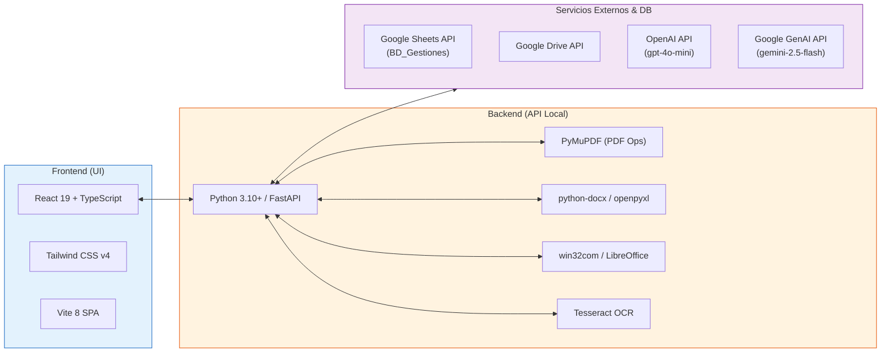
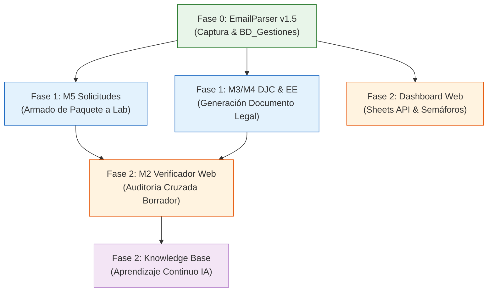

# 🛠️ Especificación Técnica y Funcional Rigurosa — Proyecto Final de Ingeniería Industrial (PFI)

> **Proyecto**: Plataforma Argos — Automatización y Auditoría del Proceso de Certificaciones COMEX de Bidcom SRL.
> **Autor**: Federico Dean | Proyecto Final de Carrera (Ingeniería Industrial).

---

## 📦 Bloque 1 — Alcance Funcional por Módulo

### 1.1 Módulo Ingreso y Parser de Mails (`EmailParser v1.5`)
* **Definición (1 oración)**: Captura solicitudes entrantes de Ingeniería en Gmail, extrae metadatos técnicos y registra el trámite en Google Sheets estableciendo la marca de tiempo inicial.
* **Input**: Email de Gmail (cuerpo HTML/Texto + asunto estructurado).
* **Output**: Fila creada en Google Sheets (`BD_Gestiones`) + Etiqueta de Gmail aplicada + Email resguardado como NO LEÍDO.
* **Lógica Determinística vs. IA**:
  * **Determinístico (Código Python / Apps Script)**: Filtrado de remitiente/asunto, verificación de duplicados por `ID_Unico`, creación de fila en Sheet, estampa de timestamp $T_{COMEX}$, asignación de etiquetas de Gmail y ejecución de `thread.markUnread()`.
  * **Inteligencia Artificial (Gemini API)**: Lectura de lenguaje natural en el cuerpo del correo para extraer JSON estructurado (modelos, especificaciones) y resumir observaciones cualitativas (estado de muestra en jaula, urgencias de embarque).
* **Intervención Humana**: **0 en la carga**. El analista simplemente visualiza el mail sin leer en su bandeja de entrada y la fila ya precargada en la planilla.

---

### 1.2 Módulo M5 — Solicitudes de Certificación
* **Definición (1 oración)**: Parsea el datasheet técnico del producto y genera la carpeta documental, las solicitudes oficiales en Excel/Word y el paquete comprimido para enviar al laboratorio.
* **Input**: Datasheet técnico en Excel (`.xlsx`) + manual en PDF + fotos en Google Drive.
* **Output**: Planilla oficial de solicitud en Excel (`.xlsm` / `.xlsx`), Nota comercial en Word (`.docx`), planilla de fotos autogenerada (`Datasheet_[Nro].xlsx`) y paquete comprimido (`.zip`).
* **Lógica Determinística vs. IA**:
  * **Determinístico (Código Python `openpyxl` / `python-docx` / `win32com`)**: Mapeo estricto de coordenadas de celdas (`C51`, `C53`, `C57`, etc.), duplicación de filas por marca, formateo tipográfico (Calibri 12) y empaquetado ZIP.
  * **Inteligencia Artificial (Google GenAI API - `AISpecsHelper`)**: Validación semántica preventiva de coherencia entre la Posición Arancelaria (PA), la descripción del producto y las normas IRAM aplicables.
* **Intervención Humana**: El analista confirma los datos en la interfaz web de Argos y hace **1 clic** para generar el paquete y subirlo a Google Drive.

---

### 1.3 Módulo M2 — Verificador de Borradores de Certificados
* **Definición (1 oración)**: Audita el certificado borrador en PDF emitido por el laboratorio comparándolo campo por campo contra la solicitud original para detectar discrepancias antes de la emisión definitiva.
* **Input**: Archivo PDF del certificado borrador + datos de la solicitud original en `BD_Gestiones` / Datasheet.
* **Output**: Reporte de Auditoría estructurado con semáforo de certidumbre (🟢 / 🟡 / 🔴) y matriz de discrepancias.
* **Lógica Determinística vs. IA**:
  * **Determinístico (Código Python `PyMuPDF` / `m2_strategies.py`)**: Extracción espacial por coordenadas `(y0, x0)` para evitar entrelazado de columnas, validación exacta de lista de SKUs, marcas y vigencia de fechas.
  * **Inteligencia Artificial (OpenAI GPT-4o-mini / Vision)**: Normalización semántica de razones sociales, equivalencias de direcciones de fábrica (`Rd.` ↔ `Road`), e interpretación de tablas irregulares en PDFs escaneados o rasterizados (Intertek, IRAM, Lenor).
* **Intervención Humana**: **Obligatoria**. El analista revisa el panel de discrepancias en la UI de Argos, confirma o descarta los warnings y aprueba la devolución al laboratorio.

---

### 1.4 Módulo M3 / M4 — Generador de DJC y Eficiencia Energética
* **Definición (1 oración)**: Extrae los datos técnicos del certificado definitivo aprobado y construye la Declaración Jurada de Conformidad legal en Word y PDF, censurando datos confidenciales del fabricante.
* **Input**: Archivo PDF del certificado definitivo + Plantilla oficial Word (`DJ Conformidad Modelo SE.docx` / `EE.docx`).
* **Output**: Documento Word (`.docx`), PDF definitivo firmado/censurado (rasterizado a JPEG a 150-200 DPI con OCR Tesseract) + texto formateado listo para copiar a ERP Taloco y código QR.
* **Lógica Determinística vs. IA**:
  * **Determinístico (Código Python `pdf_ops.py` / `m3_djc_generator.py`)**: Relleno de plantillas Word, conversión a PDF vía Microsoft Word COM (o LibreOffice Headless fallback), censura de datos del fabricante, rasterizado de imágenes JPEG y compresión a ~3 MB.
  * **Inteligencia Artificial (OpenAI Vision)**: Fallback de extracción de datos cuando el PDF del certificado es una imagen escaneada no seleccionable.
* **Intervención Humana**: El analista revisa los campos en la vista previa (`preview`) antes de disparar la generación del documento legal definitivo.

---

### 1.5 Dashboard Operativo Web
* **Definición (1 oración)**: Centraliza la visibilidad en tiempo real de todos los trámites activos con semáforos de plazo e indicadores de gestión SLA.
* **Input**: Datos leídos vía Google Sheets API desde la hoja `BD_Gestiones`.
* **Output**: Interfaz visual en React SPA con tabla interactiva, filtros por laboratorio/tipo, indicadores KPI y semáforos de plazo (🟢 🟡 🔴 ⏸️).
* **Lógica Determinística vs. IA**: **100% Determinístico**. Consultas a Sheets API y lógica matemática del motor de SLA. No utiliza IA.
* **Intervención Humana**: Visualización ejecutiva por parte de la gerencia y analistas para la toma de decisiones.

---

### 1.6 Knowledge Base (Motor IA Aprendiz)
* **Definición (1 oración)**: Almacena en archivos locales el historial de correcciones humanas y equivalencias aprobadas para incrementar la precisión del sistema con el uso.
* **Input**: Feedback del usuario al aprobar o corregir campos en las vistas previas de M2 y M3.
* **Output**: Archivos JSON locales en `argos/knowledge/` (`equivalencias.json`, `patrones_lab.json`).
* **Lógica Determinística vs. IA**:
  * **Determinístico**: Lectura y escritura de archivos JSON locales.
  * **Inteligencia Artificial**: Inyección de las reglas aprendidas dentro del contexto (prompt) de las llamadas a la API de OpenAI/Gemini (RAG Simple).
* **Intervención Humana**: Cada corrección del usuario en la UI enriquece automáticamente la base sin necesidad de programar.

---

## 🏛️ Bloque 2 — Arquitectura y Dependencias

### 2.1 Stack Tecnológico Real

* **Backend**: Python 3.10+, FastAPI (servidor ASGI Uvicorn en `:8742`), Pydantic v2.
* **Procesamiento Documental**: `PyMuPDF` (fitz), `python-docx`, `openpyxl`, `comtypes` / `pywin32`, `pytesseract`.
* **Frontend**: React 19, TypeScript 5.9, Vite 8, Tailwind CSS v4, Lucide React icons.
* **Licencias de Terceros**: 100% Código Abierto permisivo (MIT, Apache 2.0, LGPL para LibreOffice, BSD para PyMuPDF). No requiere licencias pagas de software propietario de terceros.

---

### 2.2 Entorno de Ejecución
* **Despliegue**: Corre en la **máquina local del analista** (Windows 10/11) como una aplicación de escritorio distribuida mediante ejecutable e instalador autónomo `Argos_Setup_v3_1_0.exe` (PyInstaller + Inno Setup).
* **Servidor Local**: FastAPI se inicia dinámicamente en `localhost` levantando el navegador Chrome en modo aplicación (`--app=http://127.0.0.1:8742`).

---

### 2.3 Proveedores de IA y Modalidad
* **Proveedores**: OpenAI API (`gpt-4o-mini` / `gpt-4o`) y Google GenAI SDK (`gemini-2.5-flash-lite`).
* **Modalidad**: API Cloud bajo demanda (**Pay-as-you-go**). Pago exclusivo por tokens consumidos.

---

### 2.4 Tolerancia a Fallos y Degradación Elegante (Graceful Degradation)
* **¿Qué pasa si la API de IA no está disponible o cae internet?**
  * **El sistema NO se cae ni se bloquea.**
  * Argos conmuta automáticamente a **Modo Offline / Determinístico**: utiliza la extracción estricta por coordenadas de PyMuPDF y regex locales.
  * El analista visualiza los campos extraídos por código en la vista previa y completa manualmente cualquier campo faltante, permitiendo continuar la operación sin interrupciones.

---

### 2.5 Seguridad y Privacidad de Datos (Respuesta a Evaluación de Riesgos)
* **¿Qué datos salen de la empresa hacia las APIs de IA?**
  * Se envían **únicamente fragmentos de texto técnico** del producto (nombres de modelo, especificaciones eléctricas 220V/50Hz, marcas comerciales y normativas IRAM).
  * **NUNCA salen de la empresa**: Datos financieros, precios FOB/CIF, costos, márgenes, datos de proveedores críticos, nombres de clientes ni datos de personal (PII).
  * La censura de datos sensibles del fabricante (dirección y planta en China) se ejecuta **localmente en Python** antes de exportar cualquier documento.

---

## ⏱️ Bloque 3 — Esfuerzo, Dependencias y Gantt

### 3.1 Desglose de Horas Hombre (HH) por Módulo

| Módulo / Componente | HH Desarrollo | HH Testing / Ajuste | Total HH | Dependencias Previas |
|---|---|---|---|---|
| **Fase 0: EmailParser v1.5 + Apps Script** | 30 h | 10 h | **40 HH** | Ninguna (Google Workspace) |
| **Fase 1: M5 Solicitudes 1-Clic** | 60 h | 20 h | **80 HH** | Plantillas Excel/Word |
| **Fase 1: M3/M4 Generador DJC & EE** | 85 h | 25 h | **110 HH** | Motor `pdf_ops.py` |
| **Fase 2: M2 Verificador Web con IA** | 75 h | 25 h | **100 HH** | FastAPI + Extractor PyMuPDF |
| **Fase 2: Dashboard Web & Sheets API** | 40 h | 10 h | **50 HH** | `BD_Gestiones` + Google API |
| **Fase 2: Knowledge Base (IA Aprendiz)** | 15 h | 5 h | **20 HH** | UI con Vistas Previas |
| **TOTAL PROYECTO** | **305 h** | **95 h** | **400 HH** | — |

---

### 3.2 Orden Lógico de Construcción (Diagrama de Dependencias)

---

## 💰 Bloque 4 — Costos Operativos Reales

### 4.1 Costo Mensual Estimado de APIs de IA
* **Volumen Operativo**: ~300 certificaciones/año = **~25 certificaciones/mes**.
* **Consumo de Peticiones**: ~4 llamadas a la API por trámite (parseo, validación, auditoría) = **~100 peticiones/mes**.
* **Modelo Utilizado**: OpenAI `gpt-4o-mini` ($0.15 USD / 1M tokens de entrada, $0.60 USD / 1M tokens de salida) y Gemini 2.5 Flash Lite (gratuito / marginal).
* **Costo Operativo Real de IA**: **~$2.50 a $5.00 USD / mes** (< $60 USD al año).

---

### 4.2 Costos de Infraestructura y Licencias
* **Servidores Cloud**: **$0 USD** (Ejecución 100% en infraestructura local existente).
* **Licencias de Software**: **$0 USD** (Stack de código abierto y reutilización de licencias vigentes de Google Workspace y MS Office).
* **Requerimientos de Hardware**: Computadora estándar de oficina (Windows 10/11, 4 GB RAM, procesador Core i3 o superior).

---

## ⚠️ Bloque 5 — Límites, Riesgos y Mantenimiento

### 5.1 ¿Qué NO puede hacer el sistema? (Límites del Alcance)
* **No realiza ensayos físicos de laboratorio**: El tiempo de prueba en jaula ($T_{LAB}$) depende del organismo certificador.
* **No firma digitalmente ante la Secretaría de Industria**: La firma legal del apoderado se realiza en los sistemas oficiales del gobierno (TAD).
* **No reemplaza la decisión humana**: Argos es un sistema de soporte y aceleración; la aprobación final es responsabilidad del analista.

---

### 5.2 Control de Errores en Datos Regulatorios (Human-in-the-Loop)
* **Pregunta de Riesgo**: ¿Qué pasa si el modelo de IA lee mal un modelo o especificación?
* **Mecanismo de Contención**: **Ningún documento legal se genera a ciegas.** 
  * El sistema presenta una pantalla de **Vista Previa (Preview)** con resaltado de incertezas (semáforo de confianza 🟢🟡🔴).
  * El analista valida visualmente los datos en 5 segundos antes de hacer clic en "Confirmar y Generar".
  * Si hay un error de lectura, el analista lo corrige en pantalla y la corrección realimenta la Knowledge Base para el futuro.

---

### 5.3 Mantenimiento Requerido
* **Cambio de Formato en Certificados de Laboratorios**: Ajuste leve en los extractores de coordenadas o actualización de prompts en `m2_strategies.py`.
* **Cambios Normativos (Ej: Nueva resolución de Eficiencia Energética)**: Actualización del archivo de configuración estructurado `ee_families.json`.
* **Mantenimiento de Software**: Mínimo. Las dependencias están congeladas en el ejecutable empaquetado `Argos_Setup_v3_1_0.exe`.

---

### 5.4 Transferencia Operativa y Sustentabilidad (¿Qué pasa si el autor no está?)
* **Operación**: El sistema se distribuye mediante un instalador ejecutable en 1-clic (`Argos_Setup_v3_1_0.exe`) con interfaz gráfica intuitiva en español. Cualquier miembro del equipo (ej. Ariana) lo opera sin conocimientos de programación.
* **Mantenimiento Técnico**: El código cuenta con tipado estricto (TypeScript / Pydantic), documentación técnica (`CONTEXT.md`), directivas de desarrollo (`rules.md`) y arquitectura limpia FastAPI/React para que el área de IT de Bidcom pueda mantenerlo o extenderlo fácilmente.
