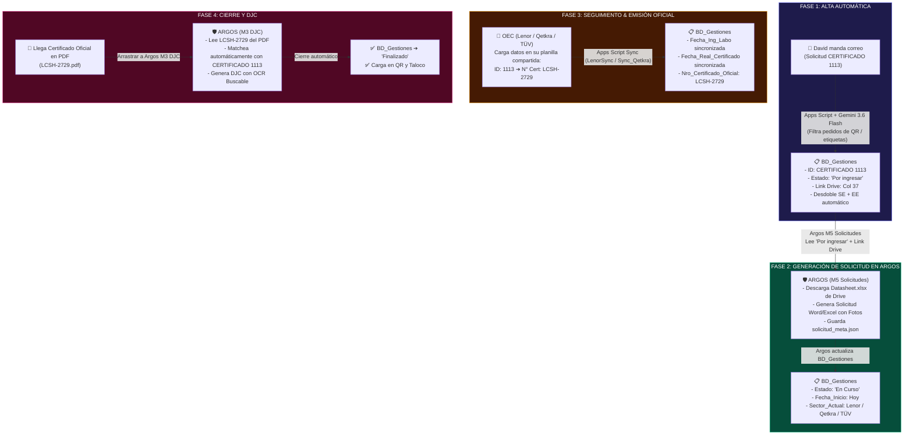

# Arquitectura del Ecosistema Integral: Argos ⟷ BD_Gestiones ⟷ Gmail

> **Fecha de Documentación**: 19 de Agosto de 2026  
> **Versión del Ecosistema**: Argos v3.2.2 / Apps Script v2.2  
> **Propósito**: Definir la separación de responsabilidades, el flujo de datos y el ciclo de vida completo de una gestión de certificación desde el correo inicial hasta la emisión de la DJC y el cierre en Taloco.

---

## 1. Principio Fundamental de Diseño
**"Separación de Responsabilidades y Orquestación Asistida"**:
* **Gmail + Google Apps Script (Gemini 3.6 Flash)**: Se encarga **ÚNICAMENTE del Disparo Inicial / Alta Nueva** de trámites entrantes. No intenta perseguir 20 estados intermedios por email.
* **BD_Gestiones (Google Sheets)**: Es la **Base de Datos Maestra y Tablero Central de Control** (36 columnas oficiales + Col 37 Link Drive).
* **Scripts de Sincronización Externa (`LenorSync` / `Sync_Qetkra`)**: Se traen automáticamente las fechas de laboratorio y el **Número de Certificado Oficial emitido** (`LCSH-2729`, `Q-AR-XXXX`) hacia `BD_Gestiones`.
* **ARGOS (Software de Escritorio)**: Es el **Panel de Control y Motor Operativo**. Cuando el usuario realiza acciones reales (Generar Solicitud, Auditar Borrador, Emitir DJC), Argos actualiza los estados en `BD_Gestiones` y genera los documentos oficiales con OCR.

---

## 2. Diagrama de Flujo de Punta a Punta

---

## 3. Detalle de Cada Fase

### Fase 1: Alta en Gmail (Apps Script `EmailParser_Solicitudes.gs v2.2`)
1. **Detección**: Escanea correos de David Barrera de los últimos 14 días con asunto `CERTIFICADO`.
2. **Razonamiento con IA**:
   * Descarta pedidos de QR preliminares (`PEDIDO_QR_PRELIMINAR`) y validaciones de etiquetas.
   * Si es solicitud formal (`SOLICITUD_REAL`), extrae SKU, descripción, marca, modelos y link de Drive.
3. **Regla de Clasificación y Desdoble**:
   * `[SE + EE ORIGEN]` ➔ Crea 2 filas:
     * Fila 1: `CERTIFICADO 1113` | `Sub_Intervencion: "SE"` | `Tipo_Certificacion: "Convenio"` (o `"Nacional"`).
     * Fila 2: `CERTIFICADO 1113 [EE]` | `Sub_Intervencion: "EE"` | `Tipo_Certificacion: "Origen"`.
4. **Campos Limpios**: `Responsable`, `Fecha_de_Muestra` y `Comentarios` quedan vacíos por defecto.
5. **Anti-Duplicados y Etiquetado**: Verifica si el ID ya existe en `BD_Gestiones`, le coloca la etiqueta `Certificaciones/Procesado` y mantiene el correo como **No Leído** (`markUnread`) para el usuario.

---

### Fase 2: Gestión de Solicitud en Argos (Módulo M5)
1. **Bandeja de Entrada en Argos**: Argos lee las filas de `BD_Gestiones` con `Estado == "Por ingresar"`.
2. **Descarga de Datasheet**: Argos utiliza el URL de la Columna 37 (`Link_Drive`) para acceder a la carpeta y descargar el archivo `Datasheet_*.xlsx`.
3. **Generación Documental**:
   * Lee modelos, especificaciones técnicas y **extrae las fotografías incrustadas** en las celdas del Excel.
   * Genera el archivo oficial de solicitud (`.docx` para TÜV/Qetkra, `.xlsm` para Lenor) y la ficha técnica.
4. **Memoria Local (`solicitud_meta.json`)**: Guarda en `Solicitudes/{ID_Unico}/` todos los metadatos del trámite para futura referencia.
5. **Sincronización con BD**: Cambia el estado en `BD_Gestiones` a `En Curso` y fija la `Fecha_Inicio`.

---

### Fase 3: Seguimiento y Cruce del N° Oficial de Certificado
1. **La Certificadora asigna el N° Oficial**: En la planilla de gestión compartida (ej. `Gestion Bidcom - Lenor`), la certificadora escribe en la fila de `ID 1113` el número oficial `LCSH-2729`.
2. **Sincronización por Script**: Los scripts de sincronización (`LenorSyncfechas.gs` y `Sync_Qetkra.gs`) copian el `Nro de Certificado` y las fechas reales a `BD_Gestiones`.
3. **Cruce Maestro**: `BD_Gestiones` vincula de forma transparente el `ID_Unico` interno (`1113`) con el número oficial (`LCSH-2729`).

---

### Fase 4: Generación de DJC y Cierre en Argos (Módulo M3)
1. **Ingreso del Certificado Firmado**: Se arrastra el PDF `LCSH-2729.pdf` en el generador de DJC de Argos.
2. **Match Inteligente**:
   * Argos extrae `LCSH-2729` del PDF.
   * Busca en `BD_Gestiones` y encuentra instantáneamente que corresponde al `CERTIFICADO 1113`.
3. **Emisión de DJC**: Aplica carátula, OCR buscable y genera el paquete para TAD / Aduana.
4. **Cierre de Gestión**: Pasa el estado en `BD_Gestiones` a **`Finalizado`**, fija la fecha de cierre y queda listo para impactar en Taloco y en el código QR.
