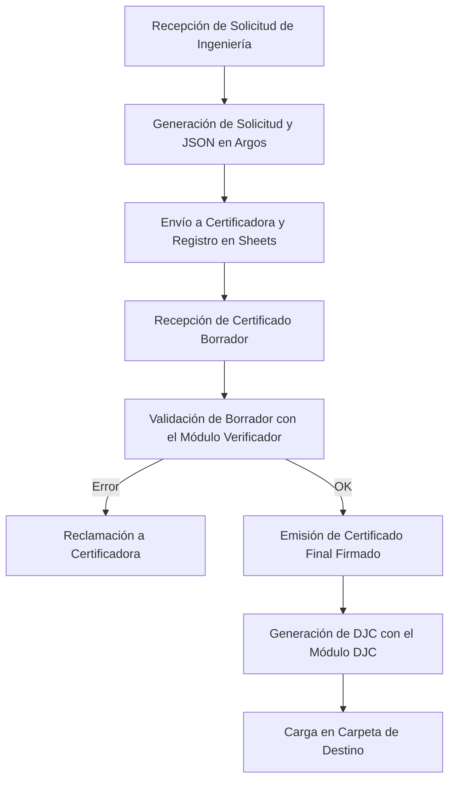

# Reglas de Negocio y Proceso de Certificación - Argos

Este documento define el flujo de trabajo general de certificación de productos en Bidcom, los módulos de la aplicación Argos y las reglas técnicas utilizadas para generar las solicitudes y notas comerciales.

---

## 1. Flujo General del Proceso de Certificación

El proceso consta de las siguientes fases y etapas:

### Paso 1: Recepción de la Solicitud de Ingeniería
- Ingeniería asigna un **Número de Certificado Local** interno (ej: `C976` o `C860`) como número de proceso.
- Se crea una carpeta de Drive que contiene toda la documentación del producto (informes de ensayo, certificados de origen, manuales, etc.). El enlace a esta carpeta se incluye en la celda **Documentación** de la planilla de ingeniería.

### Paso 2: Generación de la Solicitud en Argos
Argos procesa la planilla de ingeniería para extraer la información y generar los archivos correspondientes a la certificadora seleccionada y un archivo **JSON estructurado** que guardará todos los datos de la solicitud para su posterior validación.

Existen **4 tipos de solicitudes** en el negocio:
1. **Seguridad Eléctrica con Muestra (Lenor)**:
   - Se realiza mediante ensayos físicos sobre muestras del producto.
   - **Archivos requeridos**: Solicitud en Excel (`.xlsm` con macros) + Nota de Equivalencia de Modelos en Word + Archivos PDF con los códigos QR a tamaño real para impresión y pegado + Datasheet de Ingeniería consolidado (si la familia tiene más de 1 SKU).
2. **Seguridad Eléctrica por Convenio (Qetkra)**:
   - Se realiza mediante validación documental de certificados internacionales y test reports (sin muestra física).
   - **Archivos requeridos**: Solicitud en Excel (`.xlsx`) + Nota Aclaratoria de Modelos en Word (que declara los modelos, el QR y el formato de ficha de alimentación a utilizar).
3. **Seguridad en Juguetes con Muestra (Lenor)** *(Pendiente de desarrollo)*:
   - Requiere ensayos físicos bajo normas de juguetes.
4. **Ftalatos (Lenor)** *(Pendiente de desarrollo)*:
   - Análisis químico de plastificantes.
   - *Regla de Combinación*: Un **juguete** requiere tanto Seguridad en Juguetes como Ftalatos. Un artículo de **puericultura** requiere únicamente Ftalatos.

### Paso 3: Registro y Espera
- Se envían los archivos a la certificadora.
- Se registra en un Google Sheet la fecha de envío para seguimiento del estado del trámite.
- La certificadora procesa la solicitud y devuelve un **Certificado Borrador**.

### Paso 4: Validación con el Módulo Verificador
- Se utiliza el **Módulo Verificador** para contrastar los datos del Certificado Borrador contra el archivo **JSON estructurado** generado en el Paso 2.
- El módulo comprueba que los siguientes campos sean **exactamente idénticos** en la solicitud y el borrador:
  - Marca.
  - Modelos (principales y alternativos).
  - Características técnicas (especificaciones eléctricas).
  - Nombre del Fabricante / Fábrica.
  - Dirección del Fabricante / Fábrica.
  - Designación / Nombre del Producto.
- Si hay discrepancias, se notifica a la certificadora. Si todo está correcto, se da el OK para la emisión del certificado final.

### Paso 5: Generación de la DJC (Declaración Jurada de Conformidad)
- Una vez recibido el **Certificado Final Firmado**, se accede al **Módulo DJC** de Argos.
- Se completa la información requerida, se genera la DJC y se sube el documento PDF final a la carpeta de destino correspondiente.

---

## 2. Definición de Certificado Local vs. Certificado de Origen

- **Certificado Local (o Proceso de Ingeniería)**:
  - Es el número de trámite interno asignado por Bidcom (ej: `CERTIFICADO 976` o `C976`).
  - Determina el nombre de los archivos de salida. Nota: El código de proceso (ej: `Q26-XXXX-01`) en las notas de Qetkra es un número de trámite interno asignado por la certificadora y NO debe ser calculado ni modificado por la aplicación.
- **Certificado de Origen (o Certificado Internacional)**:
  - Es el código del certificado extranjero emitido por un organismo internacional (ej: `SG PSB-HS-18925` emitido por TÜV SÜD PSB).
  - Se utiliza para hacer el trámite por convenio de reconocimiento mutuo.

---

## 3. Reglas Técnicas y Mapeos de Datos (Excel/Word)

### A. Datos de Fábrica y País (Qetkra)
- La celda **B18** de la hoja "Solicitud" debe recibir únicamente el **País de la Fábrica** (ej: `"CHINA"`). No debe contener mails ni datos de contacto.
- Los campos de contacto se ubican estrictamente en las celdas inferiores:
  - **B19**: Contacto / Nombre del contacto.
  - **B20**: Teléfono.
  - **B21**: Email del proveedor.
- El país se extrae automáticamente del domicilio mediante palabras clave conocidas, tomando la última sección separada por comas y limpiando códigos postales. Si el domicilio está vacío, se asume `"CHINA"`.

### B. Campo de Laboratorio / Organismo Certificador (Qetkra)
- Dado que la solicitud se presenta ante Qetkra, el campo **Laboratorio** (celda **B35**) debe registrar al organismo internacional emisor del certificado original (ej: `TÜV SÜD PSB Pte Ltd`), el cual se extrae del campo `Organismo certificador` del datasheet.

### C. Clase de Aislación y Frase de la Ficha (Word de Qetkra)
La frase referente a la ficha de alimentación en la nota declaratoria de modelos de Qetkra se altera dinámicamente según la clase de aislación del primer SKU del producto:

- **Clase I** (ej. "Clase I", "Class I"):
  > *"El producto incluirá una ficha de alimentación Formato IRAM 2073 certificada, correspondiente a su clase de aislación."*
- **Clase II** (ej. "Clase II", "Class II"):
  > *"El producto incluirá una ficha de alimentación Formato IRAM 2063 certificada, correspondiente a su clase de aislación."*
- **Por defecto / Desconocida**:
  > *"El producto incluirá una ficha de alimentación Formato IRAM 2063 o IRAM 2073 certificada, según corresponda a su clase de aislación."*

### D. Fraccionamiento Automático de Especificaciones Técnicas
Cuando el datasheet contiene una única celda de especificaciones en lugar de columnas separadas, Argos procesa la cadena para rellenar las columnas de la hoja **Anexo de Modelos** (limpiando previamente el rango **B2:N150**):

1. **Tensión de Entrada** (Col E): Voltajes asociados a la entrada (ej. `220-240V~`).
2. **Frecuencia** (Col F): Frecuencias nominales (ej. `50Hz`).
3. **Corriente de Entrada** (Col G): Corriente de entrada de alimentación (ej. `1.5A`).
4. **Potencia** (Col H): Potencias nominales o de consumo (ej. `900W` o descripciones de modos: `Modo calor: 1020W / Modo Frio: 1350W`).
5. **Clase de Aislación** (Col I): Clase eléctrica (`Clase I` o `Clase II`).
6. **Tensión de Salida** (Col J): Voltajes de salida de fuentes/cargadores (ej. `12Vcc`).
7. **Corriente de Salida** (Col K): Corrientes nominales de salida (ej. `3A`).
8. **Grado IP** (Col L): Nivel de estanqueidad (ej. `IPX0`, `IP67`).
9. **Tipo de Casquillo** (Col M): Tipos de casquillo de iluminación (ej. `E27`, `GU10`).
10. **Característica Adicional** (Col N): Información complementaria (ej. `Refrigerante: R290`).
