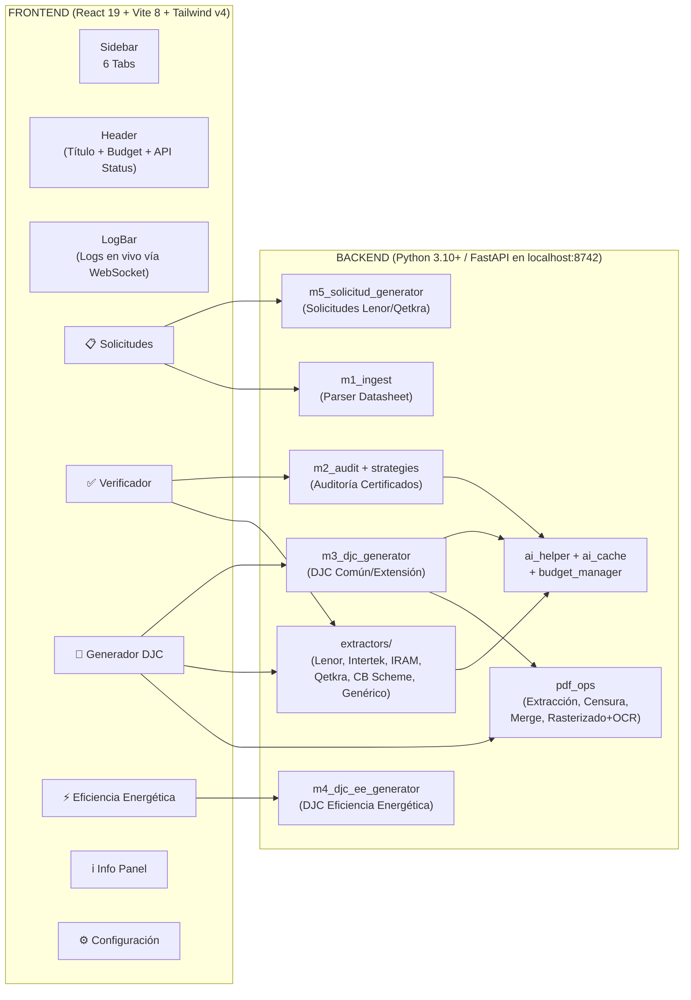

# 📋 Especificación Funcional Definitiva — Argos v3.2.0

> **Propósito**: Este documento es la **fuente única de verdad** sobre cómo DEBE funcionar Argos.

> [!IMPORTANT]
> **Regla Global — PDF Siempre Buscable**: Todo archivo PDF final que genere Argos (DJC, DJC-EE, Ficha Técnica, o cualquier documento que incluya un certificado rasterizado) **DEBE ser buscable y seleccionable** en cualquier visor PDF (Adobe Reader, Chrome, Edge, Evince). El texto no puede quedar atrapado en una imagen pura. Esta es una regla de diseño irrompible para todos los módulos actuales y futuros.
> Si algo se rompe o se modifica, se contrasta contra este documento para saber si está bien o mal.
> 
> **Última auditoría de código**: 2026-08-16

---

## 🗺️ Mapa General de la Aplicación

### Estado Real por Tab (Auditoría 2026-08-16)

| Tab | Estado | Detalle |
|---|---|---|
| 📋 **Solicitudes** | 🟢 Funcional (Lenor + Qetkra) / 🟡 Parcial (Juguetes/Ftalatos) | Genera paquete ZIP completo para Lenor y Qetkra. Juguetes y Ftalatos muestran tarjeta "en planificación". |
| ✅ **Verificador** | 🔴 Placeholder | Muestra "Módulo en construcción". El backend (`/api/verify`, `m2_audit`, `m2_strategies`) **SÍ existe y funciona**, pero la UI web no lo consume todavía. |
| 📄 **Generador DJC** | 🟢 Funcional al 100% | Extracción, edición, preview PDF modal, versiones Normal y Codificada, guardado y descarga. |
| ⚡ **Eficiencia Energética** | 🟢 Funcional al 100% | 2 sub-vistas: Wizard de 5 pasos con IA + Sandbox de etiquetas. Soporta 11 familias y multimodelo. |
| ℹ️ **Info Panel** | 🔴 Placeholder | Muestra "Módulo en construcción". |
| ⚙️ **Configuración** | 🔴 Placeholder | Muestra "Módulo en construcción". El backend (`GET/PUT /api/config`) **SÍ existe**, pero no tiene UI. |

---

## 🔧 Bugs e Inconsistencias Detectadas en la Auditoría

> [!WARNING]
> Estos son problemas reales encontrados en el código actual que deben corregirse.

| # | Ubicación | Problema | Severidad |
|---|---|---|---|
| 1 | [`launcher.py`](file:///z:/Documentos/Proyectos%20Fede/Argos_Bidcom/launcher.py) L137 | Versión inconsistente: rama Tkinter fallback dice `"Argos V2.5.0"` en lugar de `"Argos V3.2.0"`. | 🟡 Media |
| 2 | [`m2_audit.py`](file:///z:/Documentos/Proyectos%20Fede/Argos_Bidcom/modules/m2_audit.py) L96 | `_check_dates()` contiene solo `pass` — no valida vigencia de fechas del certificado. | 🟡 Media |
| 3 | [`m1_ingest.py`](file:///z:/Documentos/Proyectos%20Fede/Argos_Bidcom/modules/m1_ingest.py) L82-86 | Variables `modelos = []` y `specs = []` declaradas dos veces consecutivas (duplicación inocua pero sucia). | 🟢 Baja |
| 4 | [`startup.py`](file:///z:/Documentos/Proyectos%20Fede/Argos_Bidcom/api/startup.py) L4 | Comentario obsoleto referenciando Tauri (`"In Tauri mode this file is NOT used"`). | 🟢 Baja |
| 5 | Frontend `App.css` | Archivo residual con estilos boilerplate de Vite. No se importa en ningún lado. | 🟢 Baja |

---

# 📋 TAB 1: SOLICITUDES (M5)

## Qué hace
Recibe un archivo Excel (datasheet de ingeniería) o PDF de certificado viejo, lo parsea, y genera el paquete documental completo (Excel oficial de solicitud + Nota Word + Planilla de fotos + QR PDF) para enviar al laboratorio certificador (Lenor o Qetkra).

## Flujo de Usuario Esperado

### Paso 1 — Cargar Archivo
1. El usuario ve un **dropzone** que acepta `.xlsx`, `.xlsm`, `.xls` o `.pdf`.
2. Arrastra o selecciona el archivo.
3. El sistema lo envía a `POST /api/solicitud/parse`.
4. **Comportamiento esperado**:
   - Si es un **Excel de ingeniería**: El backend (`m1_ingest.py` → `DatasheetParser`) extrae metadatos de cabecera (N° gestión, tipo intervención, SKU principal, marca, fábrica, dirección), modelos y specs técnicas.
   - Si es un **PDF de certificado viejo**: El backend extrae texto con PyMuPDF y arma un bloque SKU simplificado con marca, modelos y specs.
5. Se muestra un **spinner** durante el parseo.
6. Al completar, avanza automáticamente al Paso 2.

### Paso 2 — Revisar y Configurar
1. **Selector de Organismo (OEC)**: El usuario elige entre:
   - `Lenor (Eléctrica)` → 🟢 Funcional
   - `Qetkra (Convenio)` → 🟢 Funcional
   - `Lenor Juguetes (Próximamente)` → 🟡 Muestra tarjeta informativa
   - `Lenor Ftalatos (Próximamente)` → 🟡 Muestra tarjeta informativa

2. **Si se selecciona Lenor o Qetkra**, se despliegan:
   - **Campos de Certificadora**: N° Certificado, Producto, Normas (sugeridas automáticamente por `regulations.py`), Reglamento, Laboratorio, Esquema (SIC 16/2025 para Lenor, 17/2025 para Qetkra).
   - **Datos de Fábrica**: Razón Social, Dirección, Contacto, Email, Teléfono.
   - **Grilla de Modelos / SKUs** (dinámica, filas agregables): SKU, Marca, Modelo Fábrica/CB, Modelos Bidcom (multilínea), Tensión, Frecuencia, Potencia, Corriente, Aislación, Specs.
   - **Dropzone opcional para QR SVG**.
   - **Botón**: `Generar Solicitud LENOR` o `Generar Solicitud QETKRA`.

3. **Al hacer clic en Generar**:
   - Se envía `POST /api/solicitud/generate` con FormData (JSON de la solicitud + SVG opcional).
   - **Backend genera**:
     - **Lenor**: `Solicitud_Modelo_Lenor.xlsm` (con macros VBA intactas vía `win32com`), `Nota_Modelo_Lenor.docx`, `Datasheet_[Nro].xlsx` (planilla de fotos con celdas combinadas), y PDF de QR vectorial.
     - **Qetkra**: `Solicitud_Modelo_qetkra.xlsx` (hojas Solicitud + Anexo de Modelos), `Nota_Modelo_qetkra.docx` (con leyenda de ficha IRAM 2063/2073 según clase de aislación y QR reemplazado).
   - Todo se empaqueta en un `.zip` en memoria y se transmite en streaming.

### Paso 3 — Descargar
1. Pantalla de éxito con:
   - Ruta de guardado en el servidor (`Solicitudes/[Certificado]/`).
   - Resumen de SKUs generados.
   - **Botón `Descargar ZIP`** (descarga el paquete generado).
   - **Botón `Nueva Solicitud`** (reinicia el flujo).

## Reglas de Negocio Críticas
- Si `win32com` falla pero está instalado, el sistema lanza `RuntimeError` en lugar de degradar a `openpyxl`. Esto es **intencional**: evita corromper las macros VBA de las planillas `.xlsm` de Lenor.
- El módulo `regulations.py` sugiere automáticamente Reglamento y Norma basándose en keywords del producto (ej: "ventilador" → Res. 16/2025 Ap. I + IRAM 60335-2-80).
- Para Qetkra, la leyenda de la nota Word cambia según la clase de aislación (Clase I → Ficha IRAM 2063, Clase II → Ficha IRAM 2073).

---

# ✅ TAB 2: VERIFICADOR (M2) — EN CONSTRUCCIÓN

## Qué hace (Backend listo, UI pendiente)
Audita certificados PDF emitidos por laboratorios comparándolos contra los datos de la solicitud original. Detecta discrepancias en titular, marca, modelos, fábrica, dirección y especificaciones técnicas.

## Estado Actual
- **Frontend**: Renderiza `PlaceholderView` ("Módulo en construcción").
- **Backend**: Completamente funcional:
  - `POST /api/verify` recibe PDFs y ejecuta `MultiCertAuditor.audit_multiple`.
  - `m2_strategies.py` implementa 4 estrategias: `AuditStrategy` (estándar), `LenorToyStrategy` (juguetes), `CBSchemeStrategy` (TÜV/SGS/BV), `QetkraStrategy`.
  - `StrategyFactory` autodetecta el OEC y aplica la estrategia correcta.

## Comportamiento Esperado (Cuando se implemente la UI)
1. **Dropzone** para subir 1 o más PDFs de certificados borradores.
2. Campos opcionales de referencia (marca, modelos, specs esperadas).
3. **Panel de resultados** con semáforo por campo:
   - 🟢 **OK**: Coincidencia exacta o fuzzy > 90%.
   - 🟡 **WARNING**: Coincidencia fuzzy 70-90% (requiere revisión humana).
   - 🔴 **FAIL**: No coincide o faltante.
4. **Validaciones duras**: Titular = "BIDCOM S.R.L." (exacto), marca, lista completa de modelos.
5. **Validaciones blandas**: Fábrica, dirección, specs (`thefuzz.partial_ratio` al 70%).
6. **Reporte exportable** con la matriz de discrepancias.

## Bug Conocido
- `_check_dates()` en `m2_audit.py` contiene solo `pass` → No valida vigencia de fechas automáticamente.

---

# 📄 TAB 3: GENERADOR DJC (M3)

## Qué hace
Extrae datos de un certificado PDF aprobado, llena la plantilla oficial Word de Declaración Jurada de Conformidad, convierte a PDF, aplica censura de datos del fabricante (versión codificada) y mergea el documento final.

## Flujo de Usuario Esperado

### Bloque 1 — Configuración Inicial
1. **Input N° Bidcom**: El usuario escribe el número de certificado Bidcom (prefijo automático 'C').
2. **Selector de Tipo de DJC**:
   - `📋 Común`: DJC estándar para el importador principal (Bidcom SRL).
   - `🔗 Extensión`: DJC para sociedades vinculadas.
3. **Si es Extensión**:
   - Selector múltiple de Sociedades (cargadas dinámicamente desde `m3_config.json`: Bemotec, Calitec, Caba Innovaciones, Eucaforest, Bfoot, Foretec, Compra Rápido).
   - Toggle `🏭 TERCEROS`: Si se activa, despliega formulario completo de datos del importador externo (Razón Social, CUIT, Marca Registrada, Domicilio Legal, Depósito, Teléfono, Email).
   - Dropzone para **Nota de Extensión PDF** (documento que autoriza la extensión).

### Bloque 2 — Subida del Certificado PDF
1. **Dropzone**: Drag & drop o clic para subir el certificado PDF.
2. Al soltar, se envía `POST /api/djc/extract`.
3. **Proceso de extracción en el backend** (Cadena completa):
   1. `pdf_ops.extract_pdf_clean_text` → Extrae texto ordenado por bandas verticales (y0 ±15px) y columnas (x0).
   2. `pdf_ops.strip_old_djc` → Detecta y elimina DJCs anteriores pegadas al inicio del PDF.
   3. `extractors/dispatcher.py` → `detect_oec()` identifica el OEC por keywords de prioridad (`Qetkra`, `Intertek`, `Bureau Veritas`, `TÜV`, `Lenor`, `IRAM`).
   4. Despacha al extractor correspondiente:
      - [`lenor.py`](file:///z:/Documentos/Proyectos%20Fede/Argos_Bidcom/modules/extractors/lenor.py): Formatos A (eléctrica), B (juguetes), C (tabular), Notas de No Aplicabilidad (ftalatos).
      - [`intertek.py`](file:///z:/Documentos/Proyectos%20Fede/Argos_Bidcom/modules/extractors/intertek.py): Formato clásico e inline con `_itk_get_val_smart`. Detecta certificados simplificados/codificados (Disposición 1/24).
      - [`iram.py`](file:///z:/Documentos/Proyectos%20Fede/Argos_Bidcom/modules/extractors/iram.py): Etiquetas bilingües con barras.
      - [`quektra.py`](file:///z:/Documentos/Proyectos%20Fede/Argos_Bidcom/modules/extractors/quektra.py): Formato `Q-AR-XXXXX`.
      - [`cb_scheme.py`](file:///z:/Documentos/Proyectos%20Fede/Argos_Bidcom/modules/extractors/cb_scheme.py): TÜV Rheinland, Bureau Veritas, SGS.
      - [`generic.py`](file:///z:/Documentos/Proyectos%20Fede/Argos_Bidcom/modules/extractors/generic.py): Fallback para OECs no reconocidos.
   5. **IA Paso 1** (`fill_missing_fields_ai`): Si hay campos críticos vacíos, la IA los extrae del texto.
   6. **IA Paso 2** (`review_extraction_ai`): Revisión semántica completa. Corrige desalineaciones (specs cruzadas con marcas, fabricantes confundidos con laboratorios). En certificados codificados/simplificados, **bloquea fabricante y dirección** para no inventar.
4. Spinner de progreso durante la extracción.

### Bloque 3 — Formulario de Revisión
1. Los campos extraídos se llenan automáticamente en el formulario editable:
   - **Identificación**: ID DJC editable (formato `DJC-SE-XXXX-CYYY-OEC-V1`) y enlace QR editable.
   - **Información del Fabricante**: Marca, Fabricante, Dirección, Descripción del producto, Modelos (multilínea), Specs Técnicas (multilínea).
   - **Datos del Certificado**: N° Certificado, Normas Aplicadas, Fecha Emisión, Fecha Última Vigilancia (autocalcula `---` si el cert tiene menos de 1 año), Próxima Vigilancia / Vencimiento (autocalculado: 2 años para Seguridad Eléctrica estándar, 4 años para Ap. IV Electrónica).
   - **Datos de Certificación**: Selectores de Reglamento, Esquema y OEC con datalist.
2. **Panel de Copiado Rápido**: Botones de 1-clic para copiar Nro Certificado, Nro Expediente DJC, Fecha Inicio, Vencimiento y Fecha Inicio de Trámite (-90 días). **Esto es crítico para el workflow diario de carga en Taloco ERP**.
3. **Versiones a Generar**: Checkboxes `📄 Normal` y `🔒 Codificada`.
   - **Codificada** (Disposición 237/2024): Fabricante y dirección se censuran en el certificado adjunto mediante `censor_cert_pdf` (reemplaza con rectángulos blancos respetando palabras de país como China, Korea).
4. **Botón `GENERAR DJC`**.

### Bloque 4 — Preview y Confirmación
1. Se abre **Modal Full-Screen** con:
   - Barra superior con selector de versiones (Normal / Codificada) si se generaron ambas.
   - `<iframe>` con el PDF compilado renderizado en vivo (Blob URL).
2. **Proceso de generación en el backend**:
   1. Llena la plantilla Word `DJ Conformidad Modelo SE.docx` (8 tablas con `_set_cell`, `_set_cell_id`, `_set_cell_hyperlink`).
   2. Convierte Word → PDF: **Motor dual** (primero `comtypes` con MS Word nativo; si falla, `subprocess` con LibreOffice headless).
   3. Si versión Codificada: `censor_cert_pdf` → Censura fabricante/dirección en el PDF del certificado.
   4. `merge_pdfs` → Combina DJC + Notas de extensión (si hay) + Certificado original usando la siguiente secuencia **obligatoria** para garantizar que el PDF final sea buscable:
      - **Paso A**: Rasteriza cada página del certificado a JPEG (2x matrix, ~150-200 DPI). Esto preserva las firmas digitales del laboratorio que se invalidarían al hacer un merge directo.
      - **Paso B**: Inserta el JPEG como fondo visual de una nueva página (el PDF se ve exactamente igual al certificado original).
      - **Paso C**: Llama a Tesseract OCR (`image_to_data`) para obtener cada palabra con sus coordenadas exactas en píxeles.
      - **Paso D**: Superpone el texto como **invisible** (`render_mode=3`) sobre la imagen, escalando coordenadas de píxeles a puntos PDF.
      - **Resultado**: El PDF se ve idéntico al original, pero **todo el texto es buscable y seleccionable** (Ctrl+F funciona). Los logs en vivo confirman: `[M3-Merge] Página 1/2: 347 palabras indexadas — PDF buscable ✓`.
      - **Fallback**: Si Tesseract no está disponible, se inserta solo la imagen (sin texto buscable) y se emite un warning en los logs. Esto es aceptable como degradación elegante pero **no es el estado esperado en producción**.
3. Botones:
   - `Descartar y corregir` → Cierra el modal, vuelve al formulario.
   - `Confirmar y guardar` → `POST /api/djc/confirm` → Guarda en `~/Documents/DJC generadas/{bidcom_folder}/` y descarga automáticamente al navegador.

## Reglas de Negocio Críticas
- **NUNCA se modifica**: El motor dual COM/LibreOffice, el rasterizado con OCR en `pdf_ops.py`, ni los mapeos de celdas de las plantillas Word.
- **PDF Final SIEMPRE buscable**: El certificado rasterizado dentro de la DJC debe tener capa de texto invisible (Tesseract `render_mode=3`). Si alguna modificación futura rompe esta funcionalidad, el comportamiento está errado.
- La vigencia es de **730 días** (2 años) para la mayoría de reglamentos, y **1460 días** (4 años) para Ap. IV Electrónica (IEC 62368).
- El cálculo de `Fecha Inicio de Trámite` es `Vencimiento - 90 días`.
- La censura en versión codificada **respeta** palabras de país (`China`, `Korea`, `Taiwan`, etc.) y **omite** líneas que contengan la marca comercial.

---

# ⚡ TAB 4: EFICIENCIA ENERGÉTICA (M4)

## Qué hace
Genera DJC y Fichas Técnicas de Eficiencia Energética bajo Resolución SIyC 438/2024, incluyendo etiquetas energéticas visuales pixel-perfect (escala A-G) para 11 familias de productos regulados.

## Tiene 2 sub-vistas (navegación por sub-barra superior):

### Sub-vista 1: 🎨 Sandbox de Etiquetas
1. **Panel izquierdo**: Selector de familia de producto (Hornos, Lavavajillas, Lavarropas, Refrigeradores, etc.), campos de datos técnicos dinámicos según la familia, carga de imagen QR.
2. **Panel derecho**: Vista previa en vivo de la etiqueta renderizada a escala real.
3. **Botón Exportar PNG**: Captura la etiqueta a PNG en alta resolución (pixelRatio 4) vía `html-to-image`.
4. **Templates especializados en [`EtiquetaEE.tsx`](file:///z:/Documentos/Proyectos%20Fede/Argos_Bidcom/frontend/src/components/EtiquetaEE.tsx)**:
   - `TemplateHorno` (escala A-G, consumo convencional/forzada, selector CHICO/MEDIANO/GRANDE).
   - `TemplateLavavajillas` (slider de agua 0-300 lts, panel de secado A-G, cubiertos, ruido dB).
   - `TemplateLavarropas` (IRAM 2141-3, 124×212mm, agua/ciclo, capacidad kg, centrifugado rpm).
   - `TemplateRefrigeradores` (IRAM 2404-3, 124×212mm, consumo anual kWh, clase climática, volúmenes frescos/congelados).
   - `TemplateGeneric` (plantilla universal dinámica para otras familias).

### Sub-vista 2: 📋 Generador DJC-EE (Wizard de 5 Pasos)

#### Paso 1 — Identificación
1. **Botón `Autocompletar con IA (Informe de Ensayo)`**: Sube PDF de informe de ensayo (TÜV/IRAM) a `POST /api/ee/auto-extract-file`.
   - Backend: PyMuPDF extrae texto (con fallback a pypdf) → `extract_ee_specs_ai()` con `gpt-4o-mini` extrae marca, modelos, familia, specs eléctricas, métricas EE, laboratorio, fechas (+4 años auto).
2. Campos manuales: N° Bidcom, Marca, Modelo (soporta múltiples separados por coma), Origen, Fabricante (codificado por defecto).

#### Paso 2 — Familia & Características
1. Selector de familia EE (11 familias cargadas de `ee_families.json` vía `GET /api/ee/families`).
2. Descripción del producto.
3. Especificaciones eléctricas: Tensión, Frecuencia, Potencia, Clase, IP, Adicionales.
4. **Métricas dinámicas de la familia**: Los campos cambian según la familia seleccionada (ej: para Refrigeradores aparecen Volumen Frescos, Volumen Congelados, Clase Climática; para Lavarropas aparecen Capacidad kg, RPM, Consumo Agua/Ciclo).

#### Paso 3 — Informe de Ensayo
1. N° Ensayo, Laboratorio, Contacto Web/Email.
2. Fecha Emisión, Fecha Vencimiento (+4 años autocalculados), Fecha Emisión DJC.

#### Paso 4 — Etiqueta EE & QR
1. **Carrusel de etiquetas multimodelo**: Si hay varios modelos, genera una etiqueta por cada uno con selector de navegación.
2. Carga de imagen QR.
3. **Botón `GENERAR DJC-EE`**.
4. Backend (`POST /api/ee/generate`):
   - Recibe parámetros + array de hasta 6 PNGs base64 de las etiquetas capturadas por el frontend.
   - Llena `DJ Conformidad Modelo EE.docx`: Inserta etiquetas en cuadrícula 3×2, elimina filas sobrantes via XML.
   - Llena `Ficha Tecnica Modelo EE.docx`: Filtra tabla de specs según familia.
   - Convierte ambos Word → PDF (motor dual COM/LibreOffice).

#### Paso 5 — Vista Previa y Confirmación
1. Resumen del archivo generado.
2. `<iframe>` con el PDF oficial compilado.
3. **Botón `Confirmar & Guardar`** → `POST /api/ee/confirm` → Guarda `.pdf` y `.docx` en disco y descarga.

---

# 🧩 COMPONENTES TRANSVERSALES

## Sidebar ([`Sidebar.tsx`](file:///z:/Documentos/Proyectos%20Fede/Argos_Bidcom/frontend/src/components/Sidebar.tsx))
- Barra lateral fija de 220px, fondo `#12121e`.
- Logo SVG de constelación Argos en púrpura (`#8b5cf6` / `#a78bfa`) + texto "ARGOS".
- 6 ítems de menú con íconos Material Symbols y efectos hover/active (borde lateral púrpura, teal para EE).
- Footer con badge de versión: `v{apiVersion || '3.2.0'}`.

## Header (en [`App.tsx`](file:///z:/Documentos/Proyectos%20Fede/Argos_Bidcom/frontend/src/App.tsx))
- Título dinámico de la pestaña activa.
- **Botón de Consumo IA**: Muestra `$ gasto / $ limite USD`. Al hacer clic abre `BudgetModal`.
- **Badge de Estado API**: Verde con glow pulse si conectado (`API Active: OK`), rojo si offline (`API Offline`).

## LogBar ([`LogBar.tsx`](file:///z:/Documentos/Proyectos%20Fede/Argos_Bidcom/frontend/src/components/LogBar.tsx))
- Barra inferior fija, 40px colapsada / 200px expandida.
- **Colapsada**: Muestra el último log con badge de estado (`[✓]` verde, `[⚠]` naranja, `[✕]` rojo) o "SISTEMA LISTO".
- **Expandida**: Historial cronológico inverso con timestamp `HH:MM:SS`, nivel y mensaje.
- Conectada vía **WebSocket** a `WS /ws/log` con auto-reconexión cada 3s.

## BudgetModal ([`BudgetModal.tsx`](file:///z:/Documentos/Proyectos%20Fede/Argos_Bidcom/frontend/src/components/BudgetModal.tsx))
- Modal con backdrop blur.
- **4 Tarjetas métricas**: Presupuesto Mensual ($5.00 USD default), Gasto Acumulado, Saldo Disponible, Peticiones Caché (hits de reuso gratuito vs total).
- **Box informativo** con rutas físicas de archivos de log (`logs/usage_ledger.json`, `logs/budget_summary.json`).
- **Tabla de consumos históricos**: Fecha/Hora, Gestión, Documento, Modelo, Tokens, Costo USD, Estado (`⚡ CACHÉ (FREE)` vs `OPENAI API`).
- Endpoints: `GET /api/budget/summary` + `GET /api/budget/ledger`.

## Launcher ([`launcher.py`](file:///z:/Documentos/Proyectos%20Fede/Argos_Bidcom/launcher.py))
- Redirige stdout/stderr a `~/Desktop/argos_debug.log`.
- Obtiene puerto TCP libre dinámicamente (`get_free_port()`).
- Arranca FastAPI con Uvicorn en hilo de fondo.
- Espera `/api/health` → Abre Chrome o Edge en modo aplicación sin bordes (`--app=http://127.0.0.1:{PORT}`).
- Panel de control con CustomTkinter (o Tkinter fallback).

> [!WARNING]
> **Bug**: Rama Tkinter fallback muestra `"Argos V2.5.0"` en lugar de `"Argos V3.2.0"`.

---

# 📧 MÓDULO EXTERNO: EmailParser (Google Workspace / Apps Script)

## Archivo
[`EmailParser_Solicitudes.gs`](file:///z:/Documentos/Proyectos%20Fede/Argos_Bidcom/google_workspace/EmailParser_Solicitudes.gs) — **Versión 1.5**

## Qué hace
Monitorea correos entrantes de Ingeniería (David Barrera) en Gmail, parsea solicitudes de certificación, crea filas automáticas en Google Sheets (`BD_Gestiones`) y aplica etiquetas de Gmail.

## Comportamiento Esperado
1. **Solicitud NUEVA detectada** (mail de David con asunto `Solicitud CERTIFICADO XXXX [...]`):
   - Crea fila en `BD_Gestiones` con datos parseados.
   - Estampa `Fecha_Solicitud_Ing` (timestamp exacto del email para medir $T_{COMEX}$).
   - Aplica la etiqueta de Gmail correspondiente:
     - SE Nacional → `Activos/SE`
     - Convenio → `Activos/Convenio`
     - Juguetes / Puericultura → `Activos/SJ + FT`
     - INAL Registro de Envase → `INAL/RE - en curso`
     - Ampliación → `Activos/Ampliacion`
   - **Marca el mail como NO LEÍDO** (`thread.markUnread()`) para que Federico lo vea en negrita en su bandeja.
   - Agrega etiqueta `Certificaciones/Procesado` (control de duplicados).

2. **Solicitud YA EXISTENTE en BD_Gestiones**:
   - **NO crea fila nueva** (prevención de duplicados por `ID_Unico`).
   - Solo agrega la etiqueta `Certificaciones/Procesado`.
   - **NO marca como no leído** (no toca el estado de lectura de mails viejos).

3. **Cambios de Estado por Palabras Clave Estrictas en Hilos**:
   - `[PAUSA SLA]` o `[FALTA MUESTRA]` o `[CONSULTA TECNICA]` → Estado = `"En Consulta"` + ⏸️ Pausa SLA Motor.
   - `[REANUDAR SLA]` o `[MUESTRA ENTREGADA]` o `[CONSULTA RESUELTA]` → Estado = `"En Curso"` + ▶️ Reanuda SLA Motor.
   - Frases informales como "te hago una consulta" **NO activan** cambios de estado.

4. **Tipos de mail mapeados**:
   - `Solicitud CERTIFICADO XXX [Clase III]` o `[SE]` → Intervención: Eléctrica (SE).
   - `Certificación por convenio [SE]` → Intervención: Convenio.
   - `CERTIFICADO XXX - AMPLIACION` → Intervención: Ampliación.
   - `Solicitud [Juguetes / Ftalatos]` → Intervención: Juguetes / Puericultura.
   - `Solicitud CERTIFICADO XXX [INAL]` con `Tipo: INAL - Registro de Envase` → Sub_Intervencion: RE.
   - INAL Libre Circulación → **EXCLUIDO del parser**.

---

# 🧠 MOTOR DE IA (Transversal)

## Componentes

### [`ai_helper.py`](file:///z:/Documentos/Proyectos%20Fede/Argos_Bidcom/modules/ai_helper.py)
- **`AIEngine`**: Clase central multi-proveedor.
  - Consulta primero la **caché local** (`ai_cache.py` → `.cache/ai_responses.json`, hash MD5 de `"{model}::{prompt}"`).
  - Valida el **presupuesto mensual** (`budget_manager.py` → `logs/usage_ledger.json`, tope $5.00 USD/mes).
  - Si pasa ambos checks: ejecuta la llamada a **OpenAI** (`gpt-4o-mini`, JSON Object mode) o **Google Gemini** (`gemini-2.5-flash-lite`), con fallback recíproco.
- **`AISpecsHelper`**: Extracción y validación de especificaciones eléctricas con tolerancia a formatos.
- **`fill_missing_fields_ai()`**: Completa campos vacíos post-extracción. Reglas estrictas: no inventar fabricantes, no truncar modelos.
- **`review_extraction_ai()`**: Revisión semántica completa. Corrige desalineaciones. Bloquea fabricante/dirección en certificados codificados.
- **`extract_ee_specs_ai()`**: Extracción especializada de informes de ensayo EE bajo Res. 438/2024.

### [`ai_cache.py`](file:///z:/Documentos/Proyectos%20Fede/Argos_Bidcom/modules/ai_cache.py)
- Cache local en `.cache/ai_responses.json`. Hash MD5 del prompt. Evita repetir consultas idénticas.

### [`budget_manager.py`](file:///z:/Documentos/Proyectos%20Fede/Argos_Bidcom/modules/budget_manager.py)
- Tope mensual: $5.00 USD (variable `MAX_MONTHLY_AI_BUDGET_USD`).
- Precios por modelo en `MODEL_PRICING` (por millón de tokens).
- Registro contable en `logs/usage_ledger.json`.
- Si se supera el presupuesto, **bloquea nuevas consultas** sin caer el sistema.

## Regla de Degradación (Graceful Degradation)
- Si la API de IA no está disponible, internet cae o se agota el presupuesto → **El sistema NO se cae**.
- Conmuta a extractores determinísticos locales (PyMuPDF + regex). El analista completa manualmente lo faltante.

## Seguridad de Datos
- **Solo salen a las APIs de IA**: Fragmentos de texto técnico (marcas, modelos, specs, normativas IRAM).
- **NUNCA salen**: Datos financieros, precios FOB/CIF, costos, márgenes, datos de proveedores, datos personales. La censura del fabricante se ejecuta **localmente en Python**.

---

# 📁 ARCHIVOS DE CONFIGURACIÓN

| Archivo | Contenido | Quién lo usa |
|---|---|---|
| [`m3_config.json`](file:///z:/Documentos/Proyectos%20Fede/Argos_Bidcom/m3_config.json) | Datos institucionales Bidcom (CUIT, domicilios), 7 sociedades de extensión, firmante, URL base QR, OECs y resoluciones vigentes. | M3 (DJC), Frontend (config, sociedades). |
| [`ee_families.json`](file:///z:/Documentos/Proyectos%20Fede/Argos_Bidcom/ee_families.json) | Catálogo de 11 familias EE (Res. 438/2024). Campos dinámicos de UI y correspondencias para Ficha Técnica. | M4 (DJC-EE), Frontend (selector de familia). |
| [`oec_rules.json`](file:///z:/Documentos/Proyectos%20Fede/Argos_Bidcom/oec_rules.json) | Reglas y advertencias por OEC para inyectar en prompts de IA. | `ai_helper.load_oec_context()`. |
| [`.env`](file:///z:/Documentos/Proyectos%20Fede/Argos_Bidcom/.env.example) | `OPENAI_API_KEY`, `GEMINI_API_KEY`. | `ai_helper.py`, `api/main.py`. |

---

# 🔄 REGLA DE SINCRONIZACIÓN DE VERSIONES

Cuando se consolida una release, estos **6 archivos** deben tener la misma versión:

1. `CHANGELOG.md`
2. `launcher.py` (línea del título CustomTkinter **Y** línea del fallback Tkinter)
3. `api/main.py` (response de `/api/health`)
4. `frontend/src/components/Sidebar.tsx` (fallback del badge)
5. `frontend/package.json` (`"version"`)
6. `argos_installer.iss` (`AppVersion`)

> [!IMPORTANT]
> La versión NO se incrementa durante desarrollo intermedio. Solo al consolidar una release estable.
