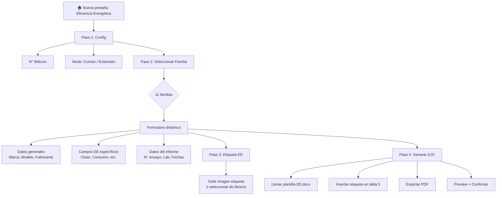

# Módulo DJC de Eficiencia Energética (EE)

## Contexto

La Resolución SIyC 438/2024 establece el régimen de etiquetado de eficiencia energética para **11 familias de productos**. A diferencia del módulo SE (seguridad eléctrica), donde la DJC se hace contra un **certificado** emitido por un OEC, en EE la DJC se hace contra un **informe de ensayo** de laboratorio. No hay un OC (Organismo de Certificación) involucrado — el fabricante/importador declara por cuenta propia en base a los resultados de ensayo.

---

## Análisis de la Resolución 438/24

### Las 11 Familias de Productos

| # | Familia | Norma IRAM Base | Campos Ficha Técnica (Anexo V) |
|---|---------|-----------------|-------------------------------|
| 1 | **Refrigeradores / Congeladores / Freezers** | IRAM 2404-3 | Categoría, Clase EE, IEE, Consumo kWh/año, Vol. frescos, Vol. congelados, Ruido, Estrellas, Clase climática |
| 2 | **Lavarropas eléctricos** | IRAM 2141-3 | Clase EE, Consumo C (kWh/kg), Consumo/ciclo, Agua/ciclo, Capacidad kg, Clase centrifugado, Eficacia extracción agua, RPM max, Duración ciclo, Clase lavado, Índice lavado, Ruido |
| 3 | **Acondicionadores de aire** | IRAM 62406 | Tipo (compacto/dividido on-off/inverter), Clase EE refrig., IEEE refrig., Consumo anual refrig., Cap. refrig. kW, Clase EE calef., COP, Consumo anual calef., Cap. calef. kW, Ruido |
| 4 | **Hornos a microondas** | IRAM 62407 + IRAM 62301 | Clase EE, IEE%, Consumo anual, Pot. salida microondas, Vol. cavidad, Vol. útil, Consumo espera W |
| 5 | **Calentadores de agua por acumulación** | IRAM 62403 | Clase EE, IEE%, Cap. nominal L, Consumo anual, Pot. nominal kW, Tiempo recalentamiento, Temp. agua extraída °C |
| 6 | **Lámparas** | IRAM 62404 | Tecnología, Clase EE, Eficacia luminosa %, Potencia W, Flujo lm, Temp. color K, Vida nominal h, Flujo mantenido % |
| 7 | **Televisores** | IRAM 62411 | Clase EE, IEE, Consumo modo encendido W, Consumo anual kWh, Diagonal cm, Consumo espera W |
| 8 | **Motores de inducción** | IRAM 62409 (mono) / IRAM 62405 (tri) | Tipo (mono/tri), Clase EE, Rendimiento %, Pot. nominal kW, N° polos |
| 9 | **Lavavajillas** | IRAM 2294-3 + IEC 60436 + IRAM 62301 | Capacidad cubiertos, Clase EE, IEE, Consumo anual kWh, Consumo/ciclo, Consumo espera, Agua anual, Agua/ciclo, Clase secado, Duración ciclo, Duración modo sin apagar, Ruido |
| 10 | **Hornos eléctricos** | IRAM 62414-1/2 + IRAM 62301 | Clase EE, IEE, Consumo anual, Consumo/ciclo, Vol. útil cavidad, Duración ciclo, Temp. máxima °C |
| 11 | **Electrobombas** | IRAM 62408 | Clase EE, Máx. eficiencia %, Caudal máx. rendimiento L/min, Altura bombeo m |

> [!IMPORTANT]
> Cada familia tiene **campos técnicos diferentes** que van en el campo "Características Técnicas" de la DJC (tabla 3, celda [6,1]). Este es el corazón del problema: el formulario debe ser dinámico según la familia seleccionada.

### Diferencias clave DJC-EE vs DJC-SE

| Aspecto | DJC-SE | DJC-EE |
|---------|--------|--------|
| **Basado en** | Certificado de OEC | Informe de ensayo de laboratorio |
| **Extracción automática** | Sí (del PDF del certificado) | No viable — datos manuales |
| **Tabla 4 [2,1]** | "N° Certificado" | "N° Ensayo" |
| **Tabla 4 [3,2]** | "Esquema 2 según ISO 17067" | "Eficiencia Energética" |
| **Tabla 4 [7,1]** | "Organismo de Certificación" | "Laboratorio" |
| **Reglamento** | Res. 16/2025, 17/2025, 313/2025, etc. | Resolución 438/2024 (Eficiencia Energética) |
| **Tabla 5** | 1 row (enlace DJC) | 2 rows: enlace + **ETIQUETA EE** |
| **Enlace DJC** | `certificado-{N}` | `certificado-{N}-ee` |
| **Vigencia informe** | Varía (2-5 años) | **4 años fijo** (Res. 438/24) |
| **Plantilla Word** | `DJ Conformidad Modelo SE.docx` | `DJ Conformidad Modelo EE (1).docx` |

### Estructura de la plantilla EE (8 tablas — **misma estructura** que SE)

```
Tabla 0: ID DJC → DJC-EE-MMAA-CNNN-COD-V1
Tabla 1: Empresa (7 rows) — idéntica a SE
Tabla 2: Representante Autorizado (3 rows) — idéntica a SE
Tabla 3: Producto (7 rows) — idéntica estructura, PERO:
         - [6,1] "Características Técnicas" → DIFERENTE POR FAMILIA
Tabla 4: Certificación (10 rows) — diferencias en labels:
         - [2,1] "N° Ensayo" en vez de "N° Certificado"
         - [3,2] "Eficiencia Energética" en vez de "Esquema 2..."
         - [7,1] "Laboratorio" en vez de "Organismo de Certificación"
Tabla 5: Otros datos — 2 rows (enlace + etiqueta EE)
Tabla 6: Fecha/Lugar — idéntica a SE
Tabla 7: Firma — idéntica a SE
```

---

## Diseño Propuesto

### Arquitectura General

> [!IMPORTANT]
> **El flujo es fundamentalmente diferente al SE**: no hay extracción automática del PDF. El usuario **selecciona la familia de producto** y **completa manualmente** los datos técnicos en un formulario dinámico. La automatización viene de:
> 1. Pre-llenar campos repetitivos (empresa, representante, fecha, lugar)
> 2. Generar el ID automáticamente
> 3. Construir el bloque de "Características Técnicas" según la familia
> 4. Integrar la etiqueta EE
> 5. Calcular fechas automáticamente (vencimiento = emisión + 4 años)



### Modelo de Datos por Familia

Para cada familia, el formulario mostraría **solo los campos que aplican**. Esto se define en un JSON de configuración:

```jsonc
// ee_families.json (nuevo archivo de config)
{
  "families": [
    {
      "id": "refrigeradores",
      "label": "Refrigeradores / Congeladores / Freezers",
      "icon": "kitchen",
      "apendice": "I",
      "norma_base": "IRAM 2404-3",
      "fields": [
        { "key": "categoria",        "label": "Categoría de aparato",    "type": "select", "options": ["Tabla 2 IRAM 2404-3"] },
        { "key": "clase_ee",         "label": "Clase de eficiencia energética", "type": "select", "options": ["A","B","C","D","E","F","G"] },
        { "key": "iee",              "label": "Índice de Eficiencia Energética (IEE)", "type": "number" },
        { "key": "consumo_anual",    "label": "Consumo de energía (kWh/año)", "type": "number" },
        { "key": "vol_frescos",      "label": "Volumen alimentos frescos (L)", "type": "number" },
        { "key": "vol_congelados",   "label": "Volumen alimentos congelados (L)", "type": "number" },
        { "key": "ruido",            "label": "Ruido (dB)",              "type": "number", "optional": true },
        { "key": "estrellas",        "label": "Clasificación estrellas", "type": "select", "options": ["⋆","⋆⋆","⋆⋆⋆","⋆⋆⋆⋆"] },
        { "key": "clase_climatica",  "label": "Clase climática",         "type": "text" }
      ]
    },
    {
      "id": "lavavajillas",
      "label": "Lavavajillas",
      "icon": "dishwasher_gen",
      "apendice": "IX",
      "norma_base": "IRAM 2294-3, IEC 60436, IRAM 62301",
      "fields": [
        { "key": "capacidad_cubiertos", "label": "Capacidad (cubiertos)", "type": "number" },
        { "key": "clase_ee",            "label": "Clase de eficiencia energética", "type": "select", "options": ["A","B","C","D","E","F","G"] },
        { "key": "iee",                 "label": "Índice de eficiencia energética (IEE)", "type": "number" },
        { "key": "consumo_anual",       "label": "Consumo de energía anual (kWh/año)", "type": "number" },
        { "key": "consumo_ciclo",       "label": "Consumo por ciclo (kWh/ciclo)", "type": "number" },
        { "key": "consumo_espera",      "label": "Consumo en modo espera (W)", "type": "number" },
        { "key": "agua_anual",          "label": "Consumo agua anual (L/año)", "type": "number" },
        { "key": "agua_ciclo",          "label": "Consumo agua por ciclo (L/ciclo)", "type": "number" },
        { "key": "clase_secado",        "label": "Clase eficacia de secado", "type": "select", "options": ["A","B","C","D","E","F","G"] },
        { "key": "duracion_ciclo",      "label": "Duración ciclo (min)", "type": "number" },
        { "key": "duracion_sin_apagar", "label": "Duración modo sin apagar", "type": "text" },
        { "key": "ruido",               "label": "Ruido (dB(A))", "type": "number", "optional": true }
      ]
    }
    // ... las 9 familias restantes
  ]
}
```

### Composición del campo "Características Técnicas"

El campo `[6,1]` de la tabla 3 se arma concatenando todos los datos EE de la familia en formato legible. Ejemplo real del DJC completado (Lavavajillas):

```
220-240 V~; 50 Hz; 1700-2040 W; Clase I; IPX1
Clase de eficiencia energética: A
Consumo de energía por ciclo: 0,65
Consumo de agua por ciclo: 9 Litros
Eficacia de secado: A
Capacidad declarada 10 cubiertos
Nivel de ruido: 49 dB(A) re 1 pW
Consumo eléctrico en modo de espera (W): 0,28 W
```

> [!TIP]
> El formulario tiene dos bloques de specs:
> 1. **Specs eléctricas base** (tensión, frecuencia, potencia, clase, IP) — comunes a todos
> 2. **Specs EE por familia** — dinámicos según la familia seleccionada
> 
> El sistema auto-compone el texto final concatenando ambos bloques.

---

## Cambios Propuestos por Capa

### Backend Python

#### [NEW] `ee_families.json`
- Configuración de las 11 familias con sus campos, normas, y opciones
- Separado de `m3_config.json` para mantener responsabilidades claras

#### [MODIFY] `m3_config.json`
- Agregar en `reglamento_options`: `"Resolución 438/2024 (Eficiencia Energética)"`
- Agregar `ee_template_filename`: `"DJ Conformidad Modelo EE (1).docx"`

#### [NEW] `modules/m4_djc_ee_generator.py`
- Nuevo generador independiente (no reutilizar M3) porque:
  - No hay extracción del PDF → flujo completamente distinto
  - La plantilla EE tiene diferencias en tabla 4 y tabla 5
  - Los "Characteristics Técnicas" se arman por familia, no por extracción
  - Necesita insertar la etiqueta EE como imagen en tabla 5
- Métodos principales:
  - `build_specs_text(family_id, ee_fields, base_specs)` → compone el texto de specs
  - `fill_template_ee(data)` → llena la plantilla Word EE
  - `insert_etiqueta_ee(doc, image_path)` → inserta la etiqueta en tabla 5
  - `generate_djc_id()` → reutiliza lógica de M3 (ya genera `EE`)
  - `export_to_pdf()` → reutiliza lógica de M3

#### [MODIFY] `modules/regulations.py`
- No es estrictamente necesario modificar ya que EE no se detecta por normas del certificado (es manual)
- Pero conviene agregar el mapeo de normas IRAM EE para consistencia futura

---

### Frontend (nueva vista + integración etiquetas)

#### [NEW] `frontend/src/views/EficienciaEnergetica.tsx`
- **Vista principal** con 2 sub-pestañas internas:
  1. **Generador DJC-EE** — el formulario de declaración jurada
  2. **Etiquetas EE** — el generador de etiquetas (actualmente en localhost:3000, se integra acá)

##### Flujo del Generador DJC-EE:
```
┌──────────────────────────────────────────────┐
│  PASO 1: CONFIGURACIÓN                       │
│  ┌─────────┐  ┌──────────────────────────┐   │
│  │ N° Bidcom│  │ Modo: Común / Extensión  │   │
│  └─────────┘  └──────────────────────────┘   │
├──────────────────────────────────────────────┤
│  PASO 2: SELECCIÓN DE FAMILIA                │
│  ┌──────┐ ┌──────┐ ┌──────┐ ┌──────┐        │
│  │🧊 Ref│ │🫧 Lav│ │❄️ AA │ │📺 TV │ ...    │
│  └──────┘ └──────┘ └──────┘ └──────┘        │
├──────────────────────────────────────────────┤
│  PASO 3: DATOS DEL PRODUCTO                  │
│  Marca: [________]  Modelo: [________]       │
│  Fabricante: [_____________]                 │
│  Specs base: [220V; 50Hz; ...]               │
│                                              │
│  ── Datos EE (Lavavajillas) ──               │
│  Clase EE: [A ▼]                             │
│  Consumo/ciclo: [0.65 kWh]                   │
│  Agua/ciclo: [9 L]                           │
│  Capacidad: [10 cubiertos]                   │
│  Clase secado: [A ▼]                         │
│  Ruido: [49 dB(A)]                           │
│  Consumo espera: [0.28 W]                    │
├──────────────────────────────────────────────┤
│  PASO 4: INFORME DE ENSAYO                   │
│  N° Informe: [CN26BARV 001]                  │
│  Laboratorio: [TÜV Rheinland ▼]             │
│  Fecha emisión: [10/03/2026]                 │
│  Fecha venc. (auto +4 años): [10/03/2030]    │
├──────────────────────────────────────────────┤
│  PASO 5: ETIQUETA EE                         │
│  [📎 Subir imagen de etiqueta]               │
│  ó [Generar etiqueta →]  (integra módulo EE) │
├──────────────────────────────────────────────┤
│  [████████ GENERAR DJC-EE ████████]          │
└──────────────────────────────────────────────┘
```

#### [MODIFY] `frontend/src/components/Sidebar.tsx`
- Reemplazar el botón externo "Etiquetas EE" (→ localhost:3000) por un ítem interno:
  - `{ icon: 'electric_bolt', label: 'Eficiencia Energética', id: 'ee' }`
- Dentro de la vista EE, sub-tabs: `DJC-EE` | `Etiquetas`

#### [MODIFY] `frontend/src/App.tsx`
- Agregar routing para `activeTab === 'ee'` → `<EficienciaEnergetica />`

#### [NEW] `frontend/src/api/client_ee.ts`
- Endpoints específicos:
  - `GET /api/ee/families` → retorna las 11 familias con sus campos
  - `POST /api/ee/generate` → genera la DJC-EE (recibe datos del form + imagen etiqueta)
  - `POST /api/ee/confirm` → guarda a disco

---

### API

#### [MODIFY] `api/main.py`
- Agregar endpoints:
  - `GET /api/ee/families` → sirve `ee_families.json`
  - `GET /api/ee/config` → config EE (laboratorios frecuentes, etc.)
  - `POST /api/ee/generate` → orquesta `m4_djc_ee_generator`
  - `POST /api/ee/confirm` → guarda archivos

---

## Fases de Implementación

### Fase 1 — Core Backend (M4)
- [ ] Crear `ee_families.json` con las 11 familias y sus campos
- [ ] Crear `m4_djc_ee_generator.py` con `fill_template_ee()` y `build_specs_text()`
- [ ] Copiar la plantilla EE a la raíz del proyecto
- [ ] Agregar reglamento EE a `m3_config.json`
- [ ] Test: generar una DJC-EE de Lavavajillas desde CLI

### Fase 2 — API Endpoints
- [ ] Endpoints GET/POST para EE en `api/main.py`
- [ ] Servir familias y config EE

### Fase 3 — Frontend Vista EE
- [ ] Vista `EficienciaEnergetica.tsx` con selector de familias
- [ ] Formulario dinámico que renderiza campos según familia
- [ ] Integrar sub-tabs: DJC-EE | Etiquetas

### Fase 4 — Integración Etiqueta EE
- [ ] Upload de imagen de etiqueta
- [ ] Inserción en tabla 5 del Word
- [ ] Conexión con generador de etiquetas EE (migrar desde localhost:3000)

### Fase 5 — Extensiones y Modos
- [ ] Modo extensión (sociedades) — reutilizar lógica de SE
- [ ] Versión codificada — misma lógica de reemplazo fabricante/dirección
- [ ] Panel de copiado rápido adaptado a EE

---

## Ganancia de Repetitividad

| Acción manual actual | Con el módulo EE |
|---------------------|------------------|
| Copiar datos empresa a mano | Auto-llenado desde config |
| Armar el bloque de specs técnicas | Formulario guiado por familia → auto-composición |
| Calcular fecha vencimiento | Auto: emisión + 4 años |
| Buscar datos del laboratorio | Selector con labs frecuentes pre-cargados |
| Armar ID DJC-EE-MMAA-... | Automático |
| Insertar etiqueta EE en Word | Upload o generación integrada |
| Generar versión codificada | Un click |
| Hacer extensiones a sociedades | Mismo flujo que SE |

> [!TIP]
> **El valor principal** de este módulo no es la extracción (no hay PDF para parsear), sino la **guía por familia + composición automática de specs**. El operador solo completa los datos técnicos del informe y el sistema arma todo el documento.
