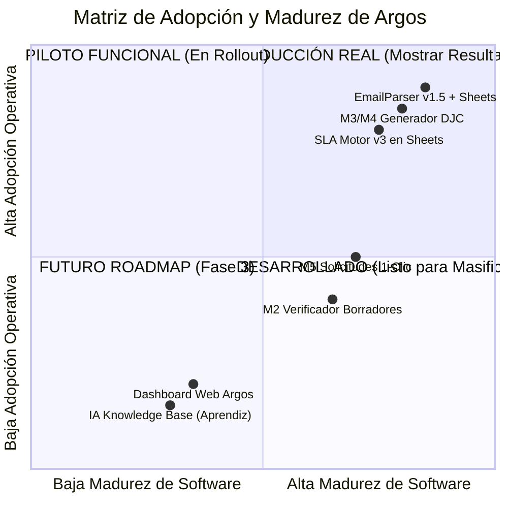

# 🎓 Respuestas Académicas y Metodológicas — Proyecto Final de Ingeniería Industrial

> **Proyecto**: Optimización del Proceso de Certificaciones de Importación (COMEX) mediante la Plataforma Argos y Automatización Google Workspace.
> **Autor**: Federico Dean — Proyecto de Grado en Ingeniería Industrial.

---

## 📐 Pregunta 1: Descomposición del Tiempo ($T_{COMEX}$ vs $T_{LAB}$) y Justificación del KPI

### 1.1 La realidad de la medición histórica
Antes de la implementación del sello automático de tiempo (`Fecha_Solicitud_Ing` vía `EmailParser v1.5`), el proceso medía la duración del trámite como un único bloque monolítico desde que se registraba el expediente hasta que se obtenía la certificación. Esta métrica ("SLA Sucio") mezclaba indistintamente la ineficiencia interna con la demora propia del laboratorio.

El tiempo total del trámite ($T_{TOTAL}$) se descompone matemáticamente en:

$$T_{TOTAL} = T_{COMEX} + T_{LAB}$$

Donde:
* **$T_{COMEX}$ (Gestión Interna)**: Tiempo transcurrido desde que Ingeniería emite la solicitud vía email hasta que COMEX valida la información, confecciona el paquete documental/muestra y lo entrega formalmente al laboratorio.
* **$T_{LAB}$ (Gestión Externa del OEC)**: Tiempo transcurrido desde la recepción conforme del laboratorio (con muestra disponible) hasta la emisión del certificado oficial o borrador.

---

### 1.2 Muestra preliminar y descomposición del exceso de plazo
Del análisis de causas raíz realizado sobre la muestra de trámites fuera del plazo meta (32 casos fuera de SLA):

```
┌────────────────────────────────────────────────────────────────────────┐
│  DESCOMPOSICIÓN DEL EXCESO DE TIEMPO (32 Casos Fuera de Plazo)         │
├───────────────────────────────────┬────────────────────────────────────┤
│  Responsabilidad Interna (T_COMEX) │  Responsabilidad Externa (T_LAB)   │
│            ~35% del exceso        │            ~65% del exceso         │
├───────────────────────────────────┼────────────────────────────────────┤
│ • Tipeo manual y armado de ZIPs   │ • Ensayos físicos en jaula/lab     │
│ • Re-trabajos por errores en PA/  │ • Saturación de cupos en IRAM/     │
│   modelos al armar la solicitud   │   Lenor / Qetkra / TÜV             │
│ • Auditoría visual lenta de       │ • Demoras administrativas de       │
│   borradores (bandeja atascada)   │   emisión del organismo (OEC)      │
└───────────────────────────────────┴────────────────────────────────────┘
```

---

### 1.3 ¿Por qué Argos SÍ justifica el cumplimiento del KPI del 90%?
Aunque el laboratorio concentra ~65% del tiempo del proceso, Argos impacta **ambos cronómetros** de manera directa e indirecta:

#### A) Impacto Directo e Inmediato en $T_{COMEX}$ (Gestión Interna)
* **Eliminación del tiempo de cola y carga**: El tiempo de procesamiento humano pasa de **~45 min a ~5 min por trámite**.
* **Reducción de días de espera en bandeja**: Al automatizar la lectura de mails y el armado de paquetes en 1 clic (M5), los días que la solicitud quedaba "estancada" en COMEX antes de enviarse al lab se reducen a **cero**.

#### B) Impacto Indirecto pero Crítico en $T_{LAB}$ (Gestión Externa)
1. **Eliminación de "Re-inicios de Reloj" por errores de formato**: 
   * *Antes*: Una solicitud enviada con un error en la Posición Arancelaria (PA), tensión/potencia o sufijos de modelo era rechazada por el laboratorio a las 2 o 3 semanas de haber ingresado. Esto provocaba que el trámite se cancelara y el reloj del laboratorio volviera a cero.
   * *Con Argos*: Las validaciones cruzadas (M5/M2) garantizan **Cero Errores de Entrada**. El laboratorio recibe la solicitud correcta en el Intento 1.
2. **Poder de Negociación y Seguimiento basado en Datos (SLA de 2 Cronómetros)**:
   * *Antes*: No se podía reclamar al laboratorio porque no había un registro fehaciente e inalterable de cuándo se entregó la muestra + solicitud.
   * *Con Argos*: Con el timestamp comprobable de $T_{LAB}$, COMEX cuenta con evidencia objetiva para exigir cumplimiento de los plazos contractuales, activar alertas tempranas antes de superar el P50/P75 y aplicar presiones comerciales respaldadas por datos.
3. **Gestión Activa de Pausas (`[PAUSA SLA]`)**:
   * Cuando el laboratorio se demora por falta de insumos o consultas técnicas, el uso de palabras clave explícitas congela el SLA interno, evitando que la ineficiencia externa ensucie las métricas de gestión del equipo.

#### Estado de la Medición:
El proyecto de grado plantea el diseño de los **dos cronómetros** justamente como el hallazgo metodológico clave para separar cuantitativamente la responsabilidad interna de la externa. Con la puesta en producción del sello de tiempo (`Fecha_Solicitud_Ing`), el proyecto pasa de "estimación histórica" a **medición limpia en tiempo real**.

---

## 🛠️ Pregunta 2: Matriz de Madurez Tecnológica y Adopción Operativa

Para la presentación del cronograma (Gantt) y los resultados en la tesis, el estado de desarrollo de Argos se clasifica bajo el estándar de **Niveles de Madurez Tecnológica (TRL / Maturity Matrix)**:



### Clasificación para el Gantt del Proyecto de Grado:

| Módulo / Componente | Estado Real en la Empresa | Clasificación Académica para el Gantt | Qué se puede mostrar como resultado |
|---|---|---|---|
| **EmailParser v1.5 + Sheets** | **Producción Real Diario** | **Implementado y Operativo** | Datos reales de volumen de mails parseados, tiempos de entrada $T_{COMEX}$ y etiquetas aplicadas solo. |
| **M3/M4 (Generador DJC y EE)** | **Producción Real Diario** | **Implementado y Operativo** | Cientos de DJC generadas en PDF sin errores de memoria, tiempos de confección reducidos de 10 min a 2 min. |
| **SLA Motor v3 (Sheets)** | **Producción Real Diario** | **Implementado y Operativo** | Tablero de semáforos en la planilla en uso continuo. |
| **M5 (Solicitudes de Certificación)** | **Piloto Asistido** | **Piloto en Curso / Rollout** | Generación automatizada de planillas Excel/Word en batches. Armado de paquetes ZIP. |
| **M2 (Verificador de Borradores)** | **Versión Funcional Backend** | **Desarrollado / En Fase de Migración Web** | Algoritmo de extracción por coordenadas y validación de reglas en backend Python (pendiente UI unificada). |
| **Dashboard Operativo Web & IA Aprendiz** | **Diseño y Especificación (Fase 1-2)** | **Propuesta de Mejora (Roadmap)** | Plan de implementación, arquitectura JSON Knowledge Base y mockup visual de interfaz. |

---

## 💰 Pregunta 3: Aval Gerencial, Cultura Organizacional y Valorización Económica

### 3.1 Patrocinio Gerencial y Percepción Interna (Capítulo 7 - Gestión del Cambio)
* **Origen de la Iniciativa**: Nació como un proyecto de **Intrapreneurship (Bottom-Up)** impulsado por el estudiante (Federico Dean, Analista de Comercio Exterior) al identificar las ineficiencias de la operación diaria.
* **Aval Formal**: Fue presentado y validado formalmente por la **Gerencia de Comercio Exterior (Emanuel Barna)** y coordinado en conjunto con el área de **Ingeniería & Planeamiento (Guido Maggiolo / David Barrera)**.
* **Impacto Organizacional**: La gerencia otorgó el aval operativo al comprobar los resultados de la versión inicial (eliminación de errores en DJC y aceleración de solicitudes), autorizando el uso de Argos como herramienta oficial de trabajo.

---

### 3.2 Valorización Económica Rigurosa del Proyecto (Cálculo del Costo)

> ⚠️ **Principio Académico de Ingeniería Industrial**: Un desarrollo interno de software **NUNCA cuesta $0**. Valorizar el proyecto como "costo cero" porque fue realizado por personal propio es un error metodológico grave en la evaluación económica de proyectos. Se debe aplicar la técnica de **Valorización de Horas Hombre (Costos Hundidos / Costo de Oportunidad)**.

#### A) Estructura de Costos de Desarrollo (CAPEX de Ingeniería)

| Concepto / Etapa | Horas Hombre (HH) | Perfil Requerido | Costo Hora Estimado (USD)* | Costo Total (USD) |
|---|---|---|---|---|
| **Relevamiento y Diagnóstico de Proceso** | 40 HH | Analista de Procesos / COMEX | $15 USD/h | $600 USD |
| **Diseño de Arquitectura y Especificación** | 40 HH | Ingeniero de Software / Sistemas | $25 USD/h | $1,000 USD |
| **Desarrollo Backend Python & FastAPI** | 120 HH | Desarrollador Backend Sr | $25 USD/h | $3,000 USD |
| **Desarrollo Frontend React & UI Dark** | 80 HH | Desarrollador Frontend | $20 USD/h | $1,600 USD |
| **Desarrollo Scripts Google Apps Script** | 40 HH | Automatizador / Scripting | $15 USD/h | $600 USD |
| **Testing, Validación y Despliegue** | 40 HH | Analista QA / Operativo | $15 USD/h | $600 USD |
| **TOTAL INVERSIÓN DESARROLLO (CAPEX)** | **360 HH** | — | — | **$8,400 USD** |

*\*Valores de hora hombre promedio de mercado para desarrolladores/analistas semi-senior en Argentina/LATAM (convertidos a USD a tipo de cambio oficial/financiero).*

#### B) Costos Operativos de Mantenimiento (OPEX Mensual)
* **Infraestructura de Servidor**: $0 USD/mes (Ejecución local en computadoras existentes de la empresa).
* **Consumo API de IA (OpenAI GPT-4o-mini / Gemini API)**:
  * Promedio de 150 solicitudes/mes × $0.03 USD/petición = **~$4.50 USD/mes**.
  * Optimización mediante caché gratuita y estructuración de prompts = **Costo operativo marginal estraordinariamente bajo (< $10 USD/mes)**.

#### C) Evaluación de Retorno de Inversión (ROI y Payback)

1. **Ahorro Directo de Horas Hombre (Mano de Obra)**:
   * Volumen de trámites anuales: **~300 certificaciones/año**.
   * Tiempo ahorrado por trámite: **40 minutos (0.66 horas)**.
   * Ahorro anual en tiempo de analista: $300 \times 0.66 = \mathbf{200\text{ HH/año}}$.
   * Valorización económica del ahorro: $200\text{ HH} \times \$15\text{ USD/h} = \mathbf{\$3,000\text{ USD/año}}$.

2. **Ahorro Indirecto por Evitación de Multas y Demurrage (Contenedores Parados en Puerto)**:
   * El costo de un contenedor parado en aduana por error documental oscila entre **$100 USD y $300 USD por día** en sobreestadía de puerto (demurrage/detention).
   * Al prevenir **solo 2 eventos de rechazo documental al año** (que históricamente generaban 15 a 30 días de demora), el ahorro directo evita pérdidas de entre **$3,000 USD y $9,000 USD anuales**.

3. **Indicadores Financieros Sintéticos**:
   * **Inversión Inicial (CAPEX Valorizado)**: **$8,400 USD**
   * **Ahorro Anual Consolidado (Directo + Prevenido)**: **~$6,000 a $9,000 USD/año**
   * **Periodo de Repago (Payback)**: **~1.1 a 1.4 años** (13 a 16 meses).
   * **Tasa Interna de Retorno (TIR a 3 años)**: **> 45%** (Proyecto altamente rentable y justificable).

---

## 📌 Resumen para la Defensa de la Tesis
Con estas tres respuestas tenés el sustento metodológico impecable:
1. **Demostrás rigor cuantitativo**: Separás $T_{COMEX}$ de $T_{LAB}$ y justificás el KPI del 90% por eliminación de re-trabajos y presión basada en datos al laboratorio.
2. **Demostrás honestidad operativa**: Mapeás con claridad qué está en producción diaria (EmailParser v1.5, M3/M4 DJC), qué está en piloto (M5) y qué es la propuesta de mejora futura.
3. **Demostrás rigor económico de Ingeniería**: No decís "costó cero"; valorizás las 360 HH de desarrollo ($8,400 USD) y demostrás un Payback de ~1 año justificando la inversión del proyecto.
