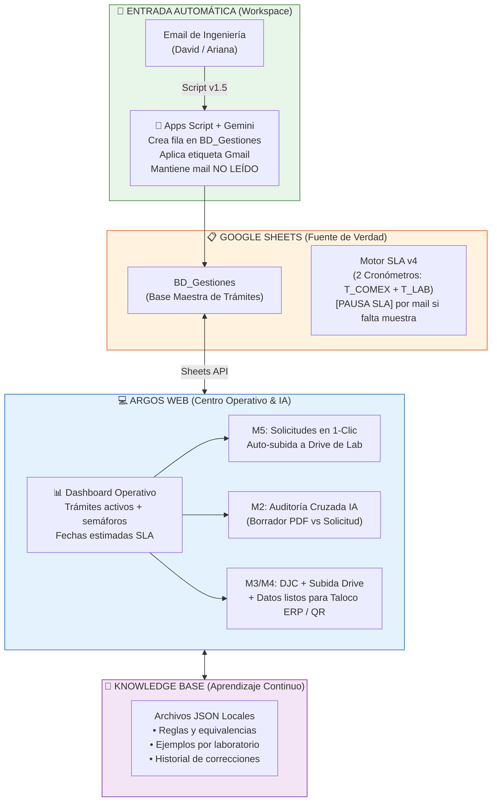

# 📄 Resumen Ejecutivo — Proyecto Argos & Ecosistema de Certificaciones COMEX Bidcom

---

## 📌 1. Introducción y Contexto (Para entendidos y no entendidos)

### ¿Qué hace Bidcom y por qué necesita certificaciones?
Bidcom SRL es una empresa argentina líder en comercio electrónico e importación de productos (tecnología, electrodomésticos, juguetes, hogar, etc.). 

Para poder importar y comercializar legalmente la gran mayoría de estos productos en Argentina, la ley exige cumplir con **regulaciones estatales obligatorias**. Según el tipo de producto, se deben realizar trámites ante laboratorios y organismos de certificación:
* **Seguridad Eléctrica (SE Nacional)**: Veladores, electrodomésticos, herramientas (garantiza que no sean peligrosos ni generen descargas/incendios).
* **Seguridad Eléctrica por Convenio**: Productos que ya tienen certificados internacionales validados por laboratorios reconocidos.
* **Seguridad en Juguetes y Puericultura (Ftalatos)**: Artículos infantiles, de bebé o juguetes (garantiza inocuidad de materiales y químicos).
* **Eficiencia Energética (EE)**: Equipos de consumo eléctrico (heladeras, aires, ventiladores) etiquetados de la A a la G según Resolución 438/2024.
* **Registro de Envase (INAL / ANMAT)**: Vajilla, termos, recipientes en contacto con alimentos.

### El Problema de Origen
Históricamente, la gestión de estas certificaciones se realizaba de manera **manual y fragmentada**:
1. **Ingeniería** enviaba datos por email ➔ **COMEX** los tipeaba a mano en planillas Excel (`BD_Gestiones`).
2. Se armaban manualmente carpetas comprimidas (ZIP) con solicitudes Word, datasheets, manuales y fotos para enviar a los laboratorios (Lenor, Qetkra, TÜV, etc.).
3. Al recibir los borradores de certificados de los laboratorios, un analista debía **comparar a ojo** cientos de números de modelo, marcas y especificaciones técnicas contra las solicitudes originales.
4. Una vez aprobado el certificado, había que armar manualmente las **Declaraciones Juradas de Conformidad (DJC)**, subirlas a Google Drive, actualizar la planilla y cargar los datos en el sistema ERP (`Taloco`) y sistema QR de empaque.

**Consecuencias**: Se gastaban más de 45 minutos de trabajo manual por cada trámite, con riesgo de **errores humanos invisibles** (ej: inversión de dígitos en un modelo) que provocaban rechazos regulatorios y **demoras de 30 a 60 días en la liberación de contenedores en aduana**, sumado a la pérdida de visibilidad sobre el estado real de más de 200 trámites abiertos simultáneamente.

---

## 🛠️ 2. ¿Qué se hizo hasta hoy? (Estado Actual del Proyecto)

Para resolver este cuello de botella se desarrolló **Argos**, una plataforma de software de escritorio/web de alta performance, integrada con el ecosistema de Google Workspace de Bidcom y potenciada por Inteligencia Artificial.

### Componentes de la Plataforma Argos (v3.2.2):
* **Arquitectura de Software**: 
  * **Backend**: Desarrollado en Python con FastAPI (puerto dinámico `:8742`), con motores nativos de procesamiento de documentos (`PyMuPDF`, `python-docx`, `openpyxl`, `comtypes`/LibreOffice).
  * **Frontend**: Interfaz moderna tipo Single Page Application (SPA) construida en React 19, TypeScript y Tailwind CSS con diseño en tema oscuro (Dark Theme).
  * **Desktop App**: Lanzador local en Python (`launcher.py` / CustomTkinter) que abre la aplicación en modo ventana sin bordes.
  * **Instalador de 1-Clic**: Compilador automatizado (`build_exe.py` + Inno Setup) que genera el ejecutable `Argos_Setup_v3_2_2.exe`.

* **Módulos Operativos Desarrollados**:
  * **Móduo M5 (Solicitudes)**: Parsea planillas de ingeniería (Excel) y genera automáticamente las notas comerciales en Word, los Excel de solicitud oficiales para laboratorios (Lenor/Qetkra) y los paquetes ZIP listos para enviar.
  * **Módulo M2 (Verificador de Borradores)**: Audita certificados PDF contra datasheets mediante reglas de negocio estStrictas y extracción de texto por coordenadas espaciales (para certificados complejos de Intertek, IRAM o Lenor).
  * **Módulo M3/M4 (Generador de DJC y Eficiencia Energética)**: Parsea certificados PDF, extrae los datos técnicos, genera las DJC oficiales en Word, aplica marcas de agua/censura de datos confidenciales del fabricante, rasteriza sellos digitales y exporta el PDF final sin sobrecargar la memoria.

### Fase 0 — Integración con Google Workspace (Apps Script & Gmail):
Se desarrolló y puso en marcha el módulo [`EmailParser_Solicitudes.gs`](file:///z:/Documentos/Proyectos%20Fede/Argos_Bidcom/google_workspace/EmailParser_Solicitudes.gs) (**v1.5**), que automatiza la entrada de mails:
* **Lectura Inteligente**: Monitorea los correos entrantes de Ingeniería (David Barrera) de forma transparente.
* **Carga Automática**: Cuando llega una solicitud (SE, Convenio, Juguetes, Puericultura o INAL Registro de Envase RE), crea automáticamente la fila en la planilla maestra `BD_Gestiones` sin intervención humana.
* **Timestamping Preciso**: Estampa el campo `Fecha_Solicitud_Ing` con la fecha y hora exacta del mail para medir la demora interna de gestión (`T_COMEX`).
* **Resguardo del Usuario**: Le asigna su etiqueta real de Gmail (`Activos/SE`, `Activos/Convenio`, `Activos/SJ + FT`, `INAL/RE - en curso`) y **mantiene el correo como NO LEÍDO en la bandeja de entrada**, para que el analista jamás pierda el control visual de sus mails.
* **Resumen de Comentarios**: Extrae automáticamente observaciones clave del cuerpo del mail (estado de la muestra física, urgencias por embarque, particularidades del producto).

---

## 🔮 3. ¿Hacia dónde vamos? (La Idea Final y Visión Integrada)

La visión final es transformar a Argos en el **Centro Operativo Unificado** de certificaciones de Bidcom, donde cada herramienta cumple un rol específico sin solaparse:

---

## 🚀 4. Los 4 Pilares de la Solución Final

### Pilar 1: Cero Carga Manual de Entradas
* **Entrada**: 100% automatizada vía email.
* **Seguimiento**: Los cambios de estado de los mails (ej: envío de muestras, respuestas de laboratorios o emisión de borradores) actualizan la planilla de fondo.
* **Control de Pausas Estricto**: Si un laboratorio solicita muestras o hay una duda técnica, el correo incluye la palabra clave explícita `[PAUSA SLA]` o `[FALTA MUESTRA]`. El sistema pasa el trámite a estado `"En Consulta"` y **congela el reloj del SLA automáticamente**, protegiendo las métricas del equipo sin falsos positivos.

### Pilar 2: Conexión Total con Google Drive y Sheets API
* Argos web leerá la planilla `BD_Gestiones` en tiempo real vía API.
* Al hacer 1 clic en un trámite desde Argos:
  * **M5 (Solicitud)**: Busca automáticamente la carpeta del certificado en Google Drive (datasheet, manuales, fotos), arma la solicitud y la sube directamente a la carpeta compartida del laboratorio (Lenor/Qetkra), marcando la solicitud como enviada e iniciando el cronómetro del laboratorio (`T_LAB`).
  * **M3/M4 (DJC)**: Genera la DJC, crea la subcarpeta `"Formulario simplificado"` en Drive, sube los archivos y deja los datos formateados listos para copiar y pegar en el ERP `Taloco` y asociar el código QR.

### Pilar 3: Auditoría Inteligente con Aprendizaje Continuo (Human-in-the-Loop)
El mayor salto de calidad estará en la auditoría de borradores (M2):
* **Auditoría Cruzada por IA (Visión)**: El analista sube el PDF del borrador del certificado recibido del laboratorio. Argos lo compara automáticamente contra los datos originales de la solicitud.
* **Detección Fina de Errores**: Marca con precisión si hay diferencias en números de modelos, especificaciones eléctricas, nombres de fábrica o direcciones.
* **Sistema de Confianza Visual**: Cada campo muestra un semáforo de certidumbre (🟢 >95%, 🟡 80-95%, 🔴 <80%).
* **La IA Aprendiz (Knowledge Base)**: La IA nunca toma decisiones sola en documentos regulatorios. El usuario revisa en una pantalla de vista previa (`preview`). Si el usuario corrige un dato o aprueba una equivalencia (ej: `Rd.` = `Road`), esa corrección se guarda en un JSON local de reglas (`argos/knowledge/`). **Con cada certificado auditado, el sistema se vuelve más inteligente y comete menos errores en el futuro.**

### Pilar 4: Dashboard Operativo y SLA de 2 Cronómetros
Un panel central en la pantalla principal de Argos que muestra el estado de todos los trámites activos con semáforos:
* **Cronómetro 1 (`T_COMEX`)**: Mide el tiempo de gestión interna desde que la solicitud llega de Ingeniería hasta que se envía al laboratorio.
* **Cronómetro 2 (`T_LAB`)**: Mide el tiempo que tarda el laboratorio desde que recibe la solicitud + muestra hasta que emite el certificado.
* **Semáforos de Alerta**:
  * 🟢 **Verde**: En plazo normal.
  * 🟡 **Amarillo**: Atención (superó la mediana histórica).
  * 🔴 **Rojo**: Demorado (próximo a vencer).
  * ⏸️ **Pausa**: En consulta / esperando muestra.

---

## 📊 5. Cuadro Comparativo de Impacto (Antes vs. Después)

| Proceso / Métrica | Proceso Histórico (Manual) | Proyecto Argos Finalizado |
|---|---|---|
| **Carga de Solicitud** | ~5 min tipeando en Excel a mano | **0 min** (Carga automática por mail) |
| **Armado y Envío de Solicitud** | ~15 min buscando carpetas y armando ZIPs | **~1-2 min** (1 clic en Argos con subida a Drive) |
| **Auditoría de Borradores** | ~15-20 min de revisión visual propensa a error | **~2 min** (Auditoría cruzada por IA asistida) |
| **Generación y Cierre DJC** | ~10 min en 3 sistemas distintos | **~2 min** (Generación + Auto-drive + Copy ERP) |
| **Visibilidad y Rastreo** | Scrollear planillas, emails perdidos | **Dashboard central** con semáforos SLA |
| **Precisión de Auditoría** | Dependiente del ojo humano cansado | **>95% IA** (mejora continuo con feedback) |
| **Tiempo de Trabajo Manual Total** | **~45 min por trámite** | **~5-8 min por trámite** (Ahorro del >80%) |
| **Riesgo de Demoras en Aduana** | Alto por errores en datos | **Casi nulo** (verificación cruzada previa) |

---

## 💡 Conclusión
El Proyecto Argos no busca reemplazar al analista de COMEX, sino dotarlo de una herramienta de clase mundial. Al automatizar las tareas repetitivas de baja complejidad (tipear mails, armar carpetas, copiar datos) y asistir las tareas críticas con IA aprendiz (auditoría de borradores), se elimina el trabajo manual monótono, se eliminan los errores regulatorios y se logra un control total de tiempos y estado de cada importación de Bidcom.
